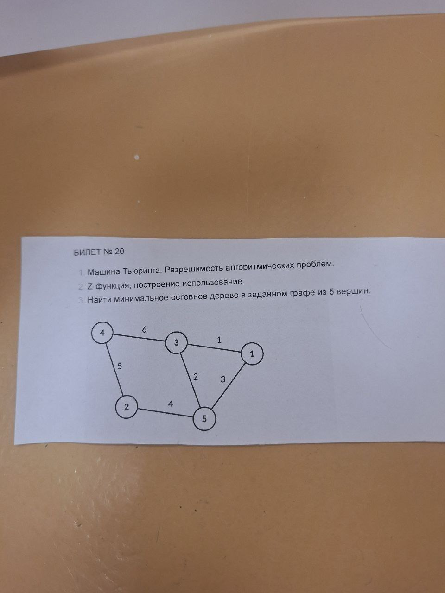

# 19. Пример задачи билета. Разбор.

# Виды зачать на экзамене
- найти кратчайший путь между 2 вершинами
- найти минимальное остовное дерево
- построить префикс-функцию
- построить Z-функцию

## Кратчайший путь между 2 вершинами

### Постановка задачи

Требуется найти кратчайший путь из заданной вершины u в заданную вершину v.

### Алгоритм решения (общая схема)

> Графы с отрицательными рёбрами могут приводить к парадоксальным ситуациям. Например, при наличии цикла отрицательного веса можно проходить по нему сколь угодно много раз, каждый раз уменьшая суммарный вес пути. В этом случае путь между двумя вершинами может иметь произвольно малый вес.

- Алгоритм Дейкстры — находит кратчайший путь от одной из вершин графа до всех остальных. Работает только для графов без рёбер отрицательного веса (на цикле будет проблема, потому вес будет становиться все меньше и меньше. В ациклическом графе ответ будет нормальный).
- Алгоритм Беллмана — Форда — находит кратчайшие пути от одной вершины графа до всех остальных во взвешенном графе (вес рёбер может быть отрицательным).
- Поиск в ширину -  находит кратчайший путь от одной из вершин графа до всех остальных, но если все рёбра имеют одинаковый вес.

### Решение задачи


Ладно, а теперь давайте подумаем, что может быть кратчайшим путём:
- количество рёбер


- количество промежуточных вершин
- количество всех вершин на пути, включая начальную и конечную
- во взвешенных графах - сумма длин всех рёбер, входящих в путь


> Несмотря на то, что в выделенном пути больше рёбер, его суммарная стоимость меньше.

## Минимальное остовное дерево



Посмотрим на задачу из 20 билета.

### Постановка задачи

Найти минимальное остовное дерево для графа из 5 вершин.

Минимальное остовное дерево - мин. подграф, связывающий все вершины, при этом сумма ребер - минимальна ([вопрос 7](./7.md)).

### Алгоритм решения (общая схема)

**Алгоритм Прима:**
1. Выбираем любую вершину, добавляем в дерево.
2. Из всех рёбер, соединяющих дерево с остальными вершинами, выбираем ребро с минимальным весом.
3. Добавляем это ребро и новую вершину в дерево.
4. Повторяем шаги 2–3, пока не включим все 5 вершин.

**Алгоритм Крускала:**
1. Сортируем все рёбра по весу.
2. Берём ребро с наименьшим весом, добавляем в дерево (если оно не образует цикл).
3. Повторяем, пока не будет n-1 рёбер (для 5 вершин — 4 ребра).

Вот эта схема довольно запарна руками без компьютера. Но если хотите - занимайтесь :)

### Решение задачи
Давайте начнем с вершины 1. Добавим ее в дерево. Вес равен 0.

Из нее есть ребра в вершину 3 веса 1 и в вершину 5 веса 3. По Приму мы должны взять ребро с наименьшим весом, значит, берем ребро 1-3 с весом 1. Запоминаем, теперь вес = 1.

Дальше двинаемся из вершины 3. Обратно в 1 мы пойти не можем, т.к. уже взяли это ребро. остаются 2 вариаента: в 4 с весом 6 и в 5 с весом 2. Очевидно, мы идем в вершину 5. Теперь вес = 1 + 2 = 3.

Мы в вершине 5. Пойти обратно в 3 мы не можем, взять 1 тоже, так как мы там были. Остается взять вершину 2 с весом 4. Общий вес = 3 + 4 = 7.

Из 2 кроме как в 4 идти больше некуда. Добавляем 5 к общему весу: 7 + 5 = 12.

Все вершины взяли. Ребер 4=5-1, циклов нет, значит, мы собрали дерево. Урааа :)

## Префикс-функция

### Постановка задачи
Ищем подстроку aba в строке abacaba. 

### Алгоритм решения (общая схема)

- Наивный алгоритм заключается в подсчёте n значений: для каждого перебирают O(n) префиксов и за O(n) сравнивают с суффиксом той же длины. Итоговая асимптотическая сложность — O(n³). 
- Алгоритм Кнута-Морриса-Пратта (КМП) - позволяет находить префикс-функцию от строки за линейное время.

### Решение задачи

```
Идея: склеить подстроку и строку, вставив между ними символ, который гарантированно не будет встречаться ни в подстроке, ни в строке, и посчитать префикс-функцию для получившейся склеенной строки. Если в какой-то момент значение префикс-функции станет равно длине искомой подстроки, это будет означать, что найдено вхождение подстроки в строку. 
```

Предполагаем, что символ \# не встречается во входном алфавите. Склеив строки, получаем строку aba\#abacaba.

Ее префикс-функция равна [0,0,1,0,1,2,3,0,1,2,3]. Видим, что в функции мы дважды получили 3, которое является длиной искомой подстроки. Следовательно, в этих позициях заканчиваются вхождения подстроки в исходную строку.

Объясню немного подробнее. Пусть длина искомой подстроки равна k. Мы нашли такой префикс склеенной строки $s[0..i]$, для которого $\pi(s[0..i]) = k$. То есть мы нашли суффикс длины k, совпавший с префиксом длины k. Префикс длины k - это и есть наша искомая подстрока. Суффикс длины k гарантированно полностью лежит в исходной строке, в которой мы ищем вхождения. Гарантирует нам это добавленный служебный символ \#. Благодаря нему, префиксы и суффиксы склеенной строки не пересекаются (за исключением самой строки). Следовательно, найденный суффикс является вхождением подстроки в строку.

## Z-функция

### Решение задачи

Для каждой позиции i перебираем для неё ответ, начиная с нуля, пока не обнаружим несовпадение или не дойдем до конца строки.


_________

Z-функция от строки s равна массиву z, где z[i] - максимальная длина j, такая что s[0..j−1]=s[i..i+j−1]. Другими словами, z[i] - длина максимального префикса строки s, совпадающего с префиксом её i-го суффикса.


Z-функция строки "abacaba"

Значение z[0] традиционно принимается равным 0, поэтому Z-функция от всей строки “abacaba” равна {0,0,1,0,3,0,1}.

В определённых случаях префиксы могут перекрываться. Например, Z-функция от строки “aaaa” равна {0,3,2,1}.