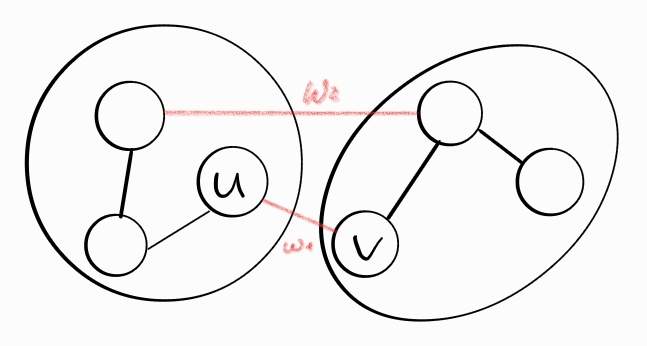

# 8. Минимальные покрывающие деревья. Алгоритм Крускала.

## Минимальные покрывающие деревья

G = (V,E) - неориентир. связный граф

w : E -> R - вес ребра

::: info <span class="defn">Опр.</span> **Минимальное остовное дерево** - мин. подграф, связывающий все вершины, при этом сумма ребер - минимальна.
:::

G' = (V,E') 

$$\sum_{(u,v) \in E'} w((u,v)) -> min$$

G = (V,E) - граф, который задан по условию.

Введем понятие "безопасного подграфа"

::: info <span class="defn">Опр.</span> **Безопасный подграф** - это подграф G' = (V,E'), который будет являться подграфом какого-то минимального остовного дерева. (безопасное - все, что является частью мин. остовного дерева).
:::

::: info <span class="defn">Опр.</span> **Безопасное ребро** - такое ребро, что при его добавлении в безопасный подграф новый подграф остается безопасным.
:::

::: info <span class="defn">Опр.</span> **Разрез** - два множества вершин графа, которые не пересекаются.
:::

### Лемма о безопасном ребре

> Самое маленькое по весу ребро в разрезе безопасного подграфа - безопасное.

Докажем лемму. Пусть F - минимальный остав. Тоглда возможны 2 варианта - ребро входит в остов или не входит в остов. Сделаем разрез подграфа.



Это наш разрез. Возможны 3 варианта развития событий:
1. w1 < w2 - НЕ может быть, т.к. если считаем, что F без ребра w1 - мин. остовное дерево, приходим к противоречию, потому что вместо w2 можем взять w1 и получим сумму меньше, а подграф F - мин. остовное дерево по условию.
2. w1 > w2 - Когда выбирали w1, мы выбирали наименьшее по весу, соответственно, такого быть не может
3. w1 = w2 - Нам не важно, какое ребро брать

В общем, если брать минимальное по весу ребро, то в итоге мы получим минимальное остовное дерево :)

Лемма помогает сделать вывод, что, если мы будем брать всегда min по весу ребро - получим min остовное дерево.

## Алгоритм Крускала

Алгоритм Крускала – это также один из алгоритмов построения *минимального остовного дерева (MST)*.

Основан на **лемме о безопасном ребре**.

Идея алгоритма заключается в том, чтобы отсортировать все ребра и пытаться добавлять их в изначально пустой остов в порядке возрастания их весов.

Порядок алгоритма:
1. Отсортировать все ребра  в порядке возрастания их весов. 
2. Если очередное ребро соединяет какие-то две уже соединенные вершины, то проигнорировать его.
3. Иначе оно является безопасным, так как оно минимальное из соединяющих какие-то две различные компоненты, и его можно добавить.

Основная сложность заключается в п. 2:  если проверять принадлежность к разным компонентам c помощью **DFS**, то асимптотика алгоритма будет $O(nm)$: так как для каждого ребра надо пройтись по всем вершинам компоненты, к которой принадлежит один из концов ребра.

Асимптотику можно улучшить до $O(m\log⁡m)$ – до стоимости сортировки ребер – если для проверок использовать [систему непересекающихся множеств](https://ru.algorithmica.org/cs/set-structures/dsu) (**СНМ**).

За исключением реализации СНМ, код получается очень коротким:

```cpp
struct Edge {
    int from, to, weight;
};

vector<Edge> edges;

sort(edges.begin(), edges.end(), [](Edge a, Edge b) {
    return a.weight < b.weight;
});

for (auto [a, b, w] : edges) {
    // компоненты разные, если лидеры разные
    if (p(a) != p(b)) {
        // добавим ребро (a, b)
        unite(a, b);
    }
}
```
