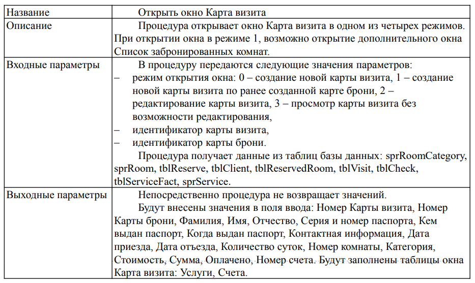

# 52. Умение строить спецификации функций

<highlight>Построение спецификаций функций информационной системы</highlight> — это процесс, при котором описывают технические детали разрабатываемой программы, позволяющей реализовать требования к системе. Спецификации указывают, что надо сделать, а не как это делать, и служат основой для дальнейшей детализации и разработки.

Функции информационной системы устанавливают в техническом задании на основе анализа целей управления, заданных ресурсов для их достижения, ожидаемого эффекта от автоматизации. Каждая функция реализуется совокупностью комплексов задач, отдельных задач и операций

## Этапы

Некоторые этапы построения спецификаций функций информационной системы:

- <highlight>Декомпозиция системы по функциональному признаку</highlight>. Выделение отдельных частей — функциональных подсистем (функциональных модулей, бизнес-приложений). Функциональный признак определяет назначение подсистемы: для какой области деятельности она предназначена и какие основные цели, задачи и функции она выполняет.
- <highlight>Выделение функциональных задач</highlight>. Обычно функциональная задача определяется как работа, которая должна быть выполнена определённым способом в определённый период для достижения целей подсистемы.
- <highlight>Иерархическая декомпозиция</highlight>. Если выделенная функция остаётся сложной для реализации, выполняется следующее разбиение на отдельные подфункции и так далее, доводя разбиение до отдельных, неделимых с точки зрения реализации задач (транзакций).
- <highlight>Формирование спецификаций</highlight>. Спецификации группируют в виде блоков информации, каждый из которых представляет собой атомарное требование, готовое для передачи разработчику в виде задачи. Каждая спецификация должна содержать информацию, достаточную для того, чтобы разработчик смог однозначно и полно реализовать требование.

## Структура

## Методы

Для построения спецификаций функций информационной системы используют, например:

- **Структурный подход.** Система разбивается на функциональные подсистемы, которые, в свою очередь, делятся на подфункции, подразделяемые на задачи, и так далее. Процесс разбиения продолжается вплоть до конкретных процедур.
- **Методологию функционального моделирования** (например, нотацию IDEF0). Основные функции декомпозируются на отдельные бизнес-процессы, работы или действия. В результате разрабатывается иерархическая модель анализируемой системы, при этом декомпозицию можно проводить многократно, до чёткого и детального описания всех процессов.

## Нормативные документы

- ГОСТ 34.602-89
- ISO IEEE 29148-2011
