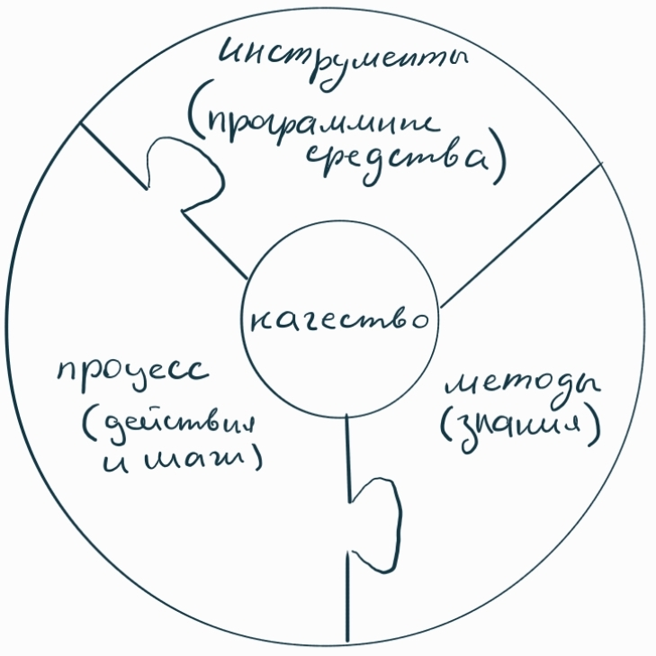

# 1. Персонал, продукт, процесс, проект. Процесс, методы, средства. Фундаментальные этапы процесса

## Персонал, продукт, процесс, проект

> Процесс создания программного обеспечения состоит из 4П: Персонал, Продукт, Процесс, Проект.

1) **Персонал -** Основные задачи заключаются в подборе и управлении.
2) **Продукт -** программная система с определенными требованиями и обоснование их выполнения.
3) **Процесс -** набор действий (шагов), которые необходимо выполнить для получения продукта в подходящей модели для организации процессов.
4) **Проект -** интеграция персонала, продукта и процесса в единую сущность. Классическая методика, связанная с разработкой сложных систем.

## Процесс, методы, средства (инструменты)

- Процесс склеивает воедино методы и инструменты. 
- Процесс определяет порядок применения методов и инструментов.
- Формирование отчетов (дают исходную информацию для управления).
- Контроль и координация активностей персонала.

## Фундаментальные этапы процесса (жизненный цикл)

1) **Спецификация** - что разрабатывать?
    - Изучить предметную область;
    - Составить план проекта;
    - Проанализировать требования

      => Спецификация требований и техническое задание

2) **Разработка** - как устроена программная система?
    - Проектирование - разработка теоретических решений устройства ПО
      + Архитеркута
      + Структуры данных
      + Алгоритмы

      => Документ проектирования 

    - Реализация (кодировние)

      => Программный код на основе теоретических решений

    - Аттестация полученной программной системы
      + Тестирование

        => Документ о выполнении тестирования

      + Сдача заказчику

        => Презентация 

3) **Сопровождение/изменение** - что дальше?
    - Исправление ошибок
    - Устранение сбоев
    - Адаптация при изменении условий
      + Операционная система
      + Пользователи
      + База данных
    - Расширение/развитие
      + Доработка пожеланий заказчика
      + Улучшение информационной безопасности

