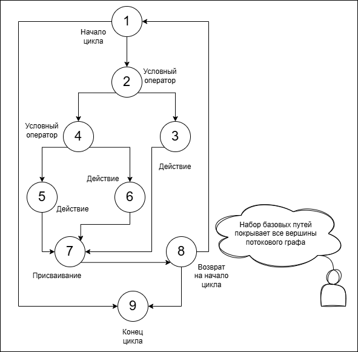

# 19. Разработка вариантов тестов. Метод белого ящика.

## Разработка вариантов тестов
::: details Основная информация
1. Мы знаем реализацию ПС ->  
[Белый ящик](19.md#метод-белого-ящика) - зная внутреннюю логику и структуру ПО, проверяем правильность реализации этой логики (алгоритмов и структур данных) решений проектирования.

2. Мы знаем структуру входных данных и ожиданмый результат ->  
[Черный ящик](20.md#метод-черного-ящика) - зная, что ПО должно делать, проверяем это на соответствующих тестах.

### Общие принципы тестирования:
1. **Тестирование  - организованный процесс.**  
План тестирования начинает разрабатываться задолго до выполнения тестирования.

2. Критерии аттестации определяют основу для выполнения аттестационного тестирования.

3. При проектировании разрабатывается основная чать модульных и интеграционных тестов на основе предполагаемых решений проектирования.

4. **Постепенное наращивание:**
    - Блочное тестирование *(маленькие тесты маленьких кусочков кода)*
    - Интеграционное тестирование *(работа связки модулей)*
    - Системное тестирование *(система в целом)* -> аттестационное тестирование

5. **Принцип "Парето"** в тестировании: 80% всех ошибок локализуются в 20% программных компонент.  
Таким образом, распределение тестов по программным компонентам неравномерно, лишь для 20% критических компонент разрабатывается 80% тестов. Не значит, что на остальные 80% кода тесты не нужны. Они нужны, но могут быть менее детальными (например, больше smoke-тестов и меньше глубоких интеграционных).

    Как найти критические компоненты?
    В основном это:
    - Ядро бизнес-логики (алгоритмы расчета, движки).
    - Модули интеграции с платежными системами, основными внешними API.
    - Системы аутентификации и авторизации.
    - Миграции и обработка критичных данных (финансовые транзакции, персональные данные).
    - Общие библиотеки и ядро платформы, используемые многими компонентами.

6. **Покрывающее тестирование.**  
Всеобъемлющее тестирование невозможно -> нужно выбрать варианты тестов из огромного числа возможных. Проведем разбиение множества тестов на классы, для каждого класса выберем несколько представителей и построим для них набор тестов.

7. **Независимое тестирование.**  
Основной объем тестирования проводит не автор кода, а другие разработчики и команда тестировщиков.
:::

## Метод белого ящика

Позволяет разрабатывать варианты тестов на основе алгоритмов и структур данных. Это структурное тестирование.

Тесты создаются на основе понимания логики программы:
- Пути выполнения программы (блок-схема)
- Условные операты (if, elif, elseif, else)
- Циклы (while, do ... while, for)
- Структуры данных (пустота, переполнение, средний случай)

Метод применяется для <u>небольних</u> частей кода.

### Варианты белого ящика
#### 1. Тестирование путей выполнения программы.  
Потоковый DFD-граф с операторами-вершинами и переходами-дугами

Цели:
- Разработать такой набор тестов, чтобы для каждого пути был хотя бы один тест.
- Разработать такой набор тестов, который бы обеспечивал выполнение каждого оператора программы -> постоение набора базовых путей, для каждого из которых разрабатывается тест.

#### 2. Тестирование циклов

$М$ - число выполнения итераций цикла (ограничение сверху).  
$m$ - фактическое число операций (наши варианты.)

1. Тест на $m = 0$ - цикл не выполняется (если возможно)
2. Тест на малые значения $m = 1,2$, чтобы проверить значения и знак (> или >=, например)
3. Тест на усредненные (типовые) значения m (исходя из программы)
4. Высокие значения $m>=M, \ m \approx M$
5. $m>M$ - выход за границы (зацикливание или что-то еще нехорошее)

Цель:
- Разработать такой набор тестов, чтобы покрыть все возможные итерации цикла.

#### 3. Тестирование состояний
    - структуры данных

**Состяние** - набор значений переменных программы.

Тестируем изменение значений переменных и структур данных.

Цель:
- Разработать такой набор тестов, чтобы покрыть все возможные состяния программы.

Пример с очередью:

#### 4. Другие способы

- Тестирование условных операторов (для блочного тестирования)
- Тестирование подсистемы реагирования на ошибки  
(список отслеживаемых ошибок: некорректные данные, переполнение и т.д.) с целью вызвать ошибки.