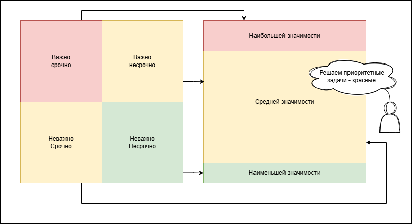
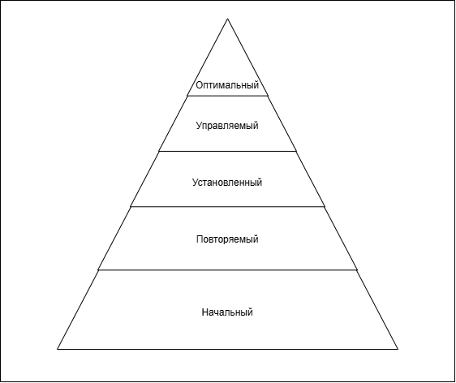

# 25. Управление проектом: Командная работа

## Командная разработка

Команда запускает каждую стадию на совещании. К совещанию должно быть известно число и состав (содержание) задач. Принимается согласованное решение - план, в котором есть подплан для каждого разработчика.

### Планирование
Сочетание индивидуальной и командной работы
- собрания <- высокоуровневые решения
- индивидуально/парно <- детальная работа
- анализ рисков <- заранее

Командная работа менее продуктивна, но более качественная с точки зрения результата.

### Принятие решений при перегрузке

При перегрузке необходимо отказываться или упрощать некоторые требования. Заранее устанавливаются приоритеты, чтобы не тратить время потом.

### Метод отбраковки

Для каждой задачи нужно решить, что делать:

- в первую очередь очень срочные и важные
- по ходу дела важные и несрочные
- в последнюю очередь то, что можно проигнорировать или делегировать

### Управленческие показатели

- человеческие ресурсы
- ресурсы на взаимодействие друг с другом или с заказчиком
    - число сообщений
    - число собраний
    - число обсуждаемых вопросов
- эффективность работы
    - число решенных зада
    - трудоемкость задач (среднее значение)
    - число просроченных задач
    - длительность задержек (нарушений сроков)
- метрики документации
    - объем документов (символы, слова, страницы)
    - распределение объема документов по стадиям
- метрики кода
    - число модулей
    - строки кода
    - число комментариев
    - размер собранной ПС
    - цикломатическая сложность
- метрики тестирования
    - число тестов
    - число выполненных тестов (запусков)
    - число ошибок
    - число регрессионных тестов (повторных)

### Модель зрелости возможностей
    модель компании-разработчика, насколько она созрела

Оценка возмодностей организации по разработке качественного ПО -> CMM (Capability Maturity Model)
- Начальный
    1. нет правил организации разработки
    2. может реализовать проект
- Повторяемый
    1. успешный повтор ранее выполненных проектов
    2. успешная реализация сходных с успешным проектов
- Установленный
    1. система правил разработки
    2. разработка по корпоративным стандартам гарантированного качества с планируемыми затратами
- Управляемый
    1. компания имеет систему
    2. сроки и стоимость могут быть точно предстказаны
    3. накопленный опыт разработки
- оптимизированный (оптимальный)
    1. установлена постоянно действующая процедура поиска и освоения новых инструментов

### Варианты разработки
1. Кустраный (нет ТППО) - успешная реализация несложных программных систем. Сложную реализовать труднее.
2. По ТППО (модель разработки)  
но если слепо следовать правилам, то не факт, что будет хороший продукт

> В успешных проектах разработка ПО стремится к технологически правильной