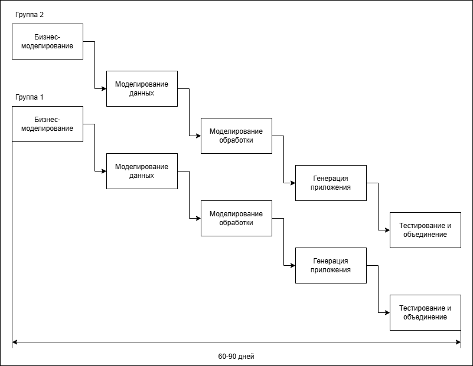

# 4. Модели процесса производства ПО. Компонентная модель. Модель RAD (быстрая разработка приложений)

## Модели процесса производства ПО

> 1) [Линейная (каскадная, водопадная) модель](../lectures/2)
>    + Классическая
>    + С возвратами
> 2) [Прототип (макет)](../lectures/3)
> 3) **Компонентная модель**
> 4) **RAD Model - быстрая разработка приложения**
> 5) [Эволюционная модель](../lectures/5)
> 6) [Инкрементальная (пошаговая) модель](../lectures/5)
> 7) [Спиральная модель](../lectures/6)

## Компонентная модель

В большинстве программных проектов применяется повторное использование некоторых программных модулей. Это обычно случается там, где разработчики проекта знают о ранее созданных программных продуктах, в составе которых есть компоненты, приблизительно удовлетворяющие требованиям разрабатываемых компонентов. Эти компоненты модифицируются в соответствии с новыми требованиями и затем включаются в состав новой системы. Неформальное решение о повторном использовании ранее созданных программных
компонентов обычно принимается независимо от общего процесса создания ПО. 

Этот подход основан на наличии большой базы существующих программных компонентов, которые можно интегрировать в создаваемую новую систему. Часто такими компонентами являются свободно продаваемые на рынке программные продукты, которые можно использовать для выполнения определенных специальных функций, таких как форматирование текста, числовые вычисления и т.п.

В этом подходе начальный этап специфицирования требований и этап аттестации такие же, как и в других моделях процесса создания ПО. А этапы, расположенные между ними, имеют следующий смысл:
1.	*Анализ компонентов.* Имея спецификацию требований, на этом этапе осуществляется
поиск компонентов, которые могли бы удовлетворить сформулированным требованиям. Обычно невозможно точно сопоставить функции, реализуемые готовыми компонентами, и функции, определенные спецификацией требований.
2.	*Модификация требований.* На этой стадии анализируются требования с учетом информации о компонентах, полученной на предыдущем этапе. Требования модифицируются таким образом, чтобы максимально использовать возможности отобранных компонентов. Если изменение требований невозможно, повторно выполняется анализ компонентов для того, чтобы найти какое-либо альтернативное решение.
3.	*Проектирование системы.* На данном этапе проектируется структура системы либо модифицируется существующая структура повторно используемой системы. Проектирование должно учитывать отобранные программные компоненты и строить структуру в соответствии с их функциональными возможностями. Если некоторые готовые программные компоненты недоступны, проектируется новое ПО.
4.	*Разработка и сборка системы.* Это этап непосредственного создания системы. В рамках рассматриваемого подхода сборка системы является скорее частью разработки
системы, чем отдельным этапом.

**Достоинства компонентной модели:**
1) Уменьшает время разработки программного продукта;
2) Уменьшает стоимость программной разработки;
3) Увеличивает производительность разработки;
4) Увеличивает надежность разработки за счет ранее протестированных компонентов.

**Недостатки компонентной модели:**
1) Неизбежны компромиссы при определении требований;
2) Законченная система может не удовлетворять всем требованиям заказчика;
3) Возможно включение вредоносных компонентов;
4) При проведении модернизации системы отсутствует возможность влиять на появление новых версий компонентов.

## Быстрая разработка приложений
Модель быстрой разработки приложений (Rapid Application Development) обеспечивает экстремально короткий цикл разработки. RAD — высокоскоростная адаптация линейной последовательной модели, в которой быстрая разработка достигается за счет использования компонентного конструирования. Если требования полностью определены, а проектная область ограничена, RAD-процесс позволяет группе создать полностью функциональную систему за очень короткое время (60-90 дней). 

RAD-подход ориентирован на разработку информационных систем и выделяет следующие этапы:
1) Бизнес-моделирование. Моделируется информационный поток между бизнес-функциями.
Ищется ответ на следующие вопросы: Какая информация руководит бизнес-процессом? Какая
генерируется информация? Кто генерирует ее? Где информация применяется? Кто обрабатывает
ее?
2) Моделирование данных. Информационный поток, определенный на этапе бизнесмоделирования, отображается в набор объектов данных, которые требуются для поддержки
бизнеса. Идентифицируются характеристики (свойства, атрибуты) каждого объекта,
определяются отношения между объектами;
3) Моделирование обработки. Определяются преобразования объектов данных, обеспечивающие
реализацию бизнес-функций. Создаются описания обработки для добавления, модификации,
удаления или нахождения (исправления) объектов данных;
4) Генерация приложения. Предполагается использование методов, ориентированных на языки
программирования 4-го поколения. Вместо создания ПО с помощью языков программирования
3-го поколения, RAD-процесс работает с повторно используемыми программными компонентами
или создает повторно используемые компоненты. Для обеспечения конструирования
используются утилиты автоматизации;
5) Тестирование и объединение. Поскольку применяются повторно используемые компоненты,
многие программные элементы уже протестированы. Это уменьшает время тестирования (хотя
все новые элементы должны быть протестированы). 

Применение RAD возможно в том случае, когда каждая главная функция может быть завершена за 3
месяца. Каждая главная функция адресуется отдельной группе разработчиков, а затем интегрируется в
целую систему.

Применение RAD имеет свои недостатки, и ограничения.
1. Для больших проектов в RAD требуются существенные людские ресурсы (необходимо создать
достаточное количество групп).
2. RAD применима только для таких приложений, которые могут декомпозироваться на отдельные
модули и в которых производительность не является критической величиной.
3. RAD не применима в условиях высоких технических рисков (то есть при использовании новой
технологии).