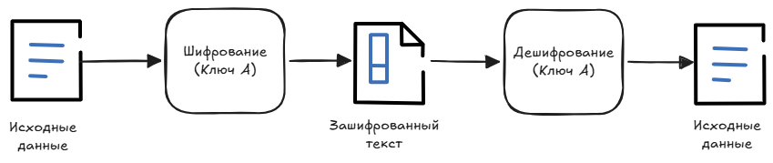

# 1. Симметричные шифры. AES.

## Симметричные шифры

> Один общий ключ для шифрования и дешифрования.

::: info ℹ️ **Симметричное шифрование** — это метод шифрования данных, при котором один и тот же криптографический ключ используется и для шифрования, и для расшифровки информации.
:::

### Принцип работы
Схема работы симметричного шифрования:

1. Отправитель и получатель заранее договариваются о ключе и алгоритме шифрования.
2. Отправитель использует ключ для шифрования данных по выбранному алгоритму.
3. Зашифрованные данные (шифротекст) передаются получателю по каналу связи.
4. Получатель применяет тот же ключ и алгоритм для расшифровки сообщения.

**Ключевая проблема:** безопасная передача ключа. Если злоумышленник перехватит единственный ключ во время обмена, вся система скомпрометирована.

### Типы алгоритмов симметричного шифрования
1. **Блочные алгоритмы** — обрабатывают данные блоками фиксированной длины (64, 128 бит и т. д.):

Примеры: AES, Blowfish.

2. **Потоковые алгоритмы** — XOR с псевдослучайной гаммой на основе ключа.

Примеры: RC4, Salsa20.

#### Достоинства и недостатки симметричного шифрования

- **Достоинства**: высокая скорость, низкие вычислительные затраты.
- **Недостатки**: проблема распределения ключей, нет доказательства авторства.

#### Области применения
Симметричное шифрование широко используется в:

- Мессенджерах (защита переписки).
- Видеоконференцсвязи (шифрование аудио‑ и видеопотоков).
- Банковских операциях (защита транзакций).
- Протоколах защищённой передачи данных (TLS/SSL — для конфиденциальности трафика после установки соединения).

## AES (Advanced Encryption Standard)

::: info ℹ️ **AES** (Advanced Encryption Standard) – современный симметричный блочный шифр, принятый как стандарт шифрования в США. 
:::

Алгоритм берёт кусок данных (128 бит) и с помощью одного секретного ключа (до 256 бит) многократно (10–14 раундов) перемешивает и подменяет его так, что восстановить исходное сообщение без ключа невозможно.

- Создатели: Винсент Рэймен, Йоан Даймен (Бельгия)
- Создан в 1998 г.
- Размер ключа: 128 / 192 / 256 бит
- Размер блока: 128 бит
- Число раундов: 10 / 12 / 14 (зависит от размера ключа)

Обладает высочайшей скоростью и эффективностью.

[Более подробно тут](https://ru.wikipedia.org/wiki/AES_(стандарт_шифрования))