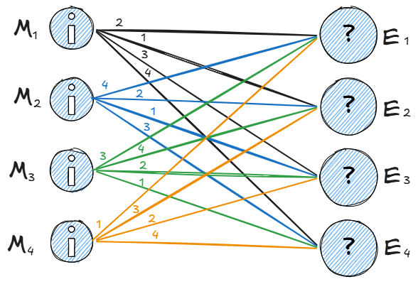

# 10. Модель Клода Шеннона. Энтропия.

## Модель Клода Шеннона

> Статистический подход к криптографии — учитывает вероятности сообщений и ключей.

> Теорема Шеннона: абсолютно стойкий шифр возможен только если энтропия ключа не меньше энтропии сообщения.

Объекты математической модели системы:
- множество сообщений $M$
- множество ключей $K$
- множество криптограмм - шифрованных сообщений $E$ 
- вероятности появления сообщений $p_i$
- вероятности выбора ключей $q_i$

> [!note] Принцип Керкгоффса: Противник знает об используемой системе шифрования всё, кроме применяемых ключей.

## Теорема Шеннона - Хартли: Предел скорости

$C = B * log_2(1+\frac{S}{N})$

где:
- C - пропускная способность сигнала (бит/с)
- B - полоса пропускания канала (Гц)
- S - Мощность сигнала (Вт)
- N - мощность шума (Вт) (Аддитивный белый гауссовский шум)

Теорема опредеяет максимальный объем данных, который можно передать через аналоговый канал с шумом. 

## Энтропия

> [!note] Энтропия
> мера неопределенности или "хаоса системы". Позволяет оценивать стойкость шифров.

$$H = -\underset{i=1}{\overset{n}{\sum}}p_ilog_2p_i,$$

где $p_i$ - вероятность i-того события, $H$ - энтропия

Чем выше энтропия ключа, тем он надёжнее.

### Свойства
- Чем равновероятностнее события, тем энтропия выше
- Максимум $H_{max} = log_2n,\ p_i=\frac{1}{n}$
- Минимум (0), когда одно событие достоверно (p = 1).