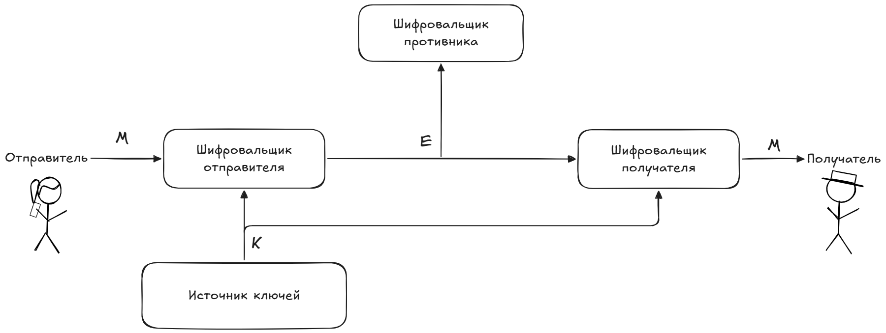

# 11. Абсолютно стойкие криптосистемы.

Система является совершенной, если перехват криптограммы не дает противнику никакой информации о сообщении.

$$P(M|E)=P(M)$$

Апостериорная вероятность - P(M|E)

Априорная вероятность - P(M)

## Шифр Вернама
Шифр Вернама – это шифр Виженера с неограниченным
неповторяющимся ключом. Используется булева функция «Исключающее ИЛИ» (XOR).

Пример:

|M|0|1|1|0|1|
|---|---|---|---|---|---|
|K|1|0|1|1|0|
|C|1|1|0|1|1|

## Условия абсолютной стойкости
1. Длина ключа $\geq$ длина сообщения
2. Ключ абсолютно случайный
3. Ключ используется однократно

Если условия соблюдены, взлом математически невозможен.

## Общие типы секретных систем
1. Системы маскировки (Невидимые чернила, маскировка в форме безобидного текста)
2. Тайные системы (конвертирование речи (для распознавания нужна специальная техника))
3. Секретные системы (существование сообщения не скрывается, проводится шифрование)