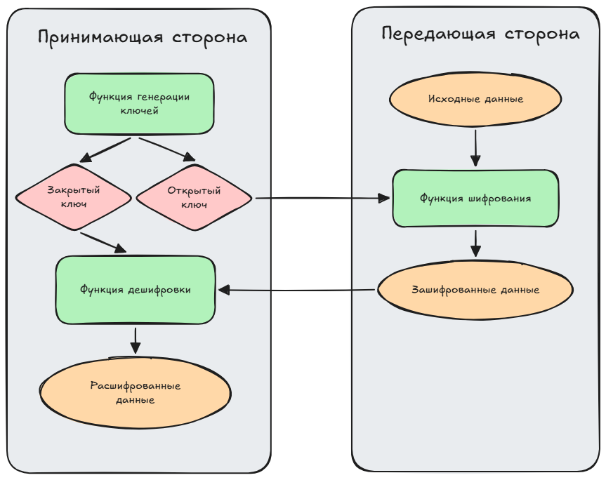
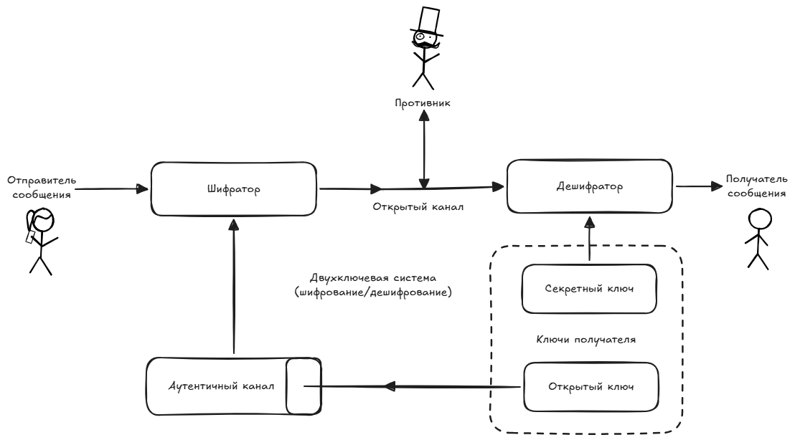
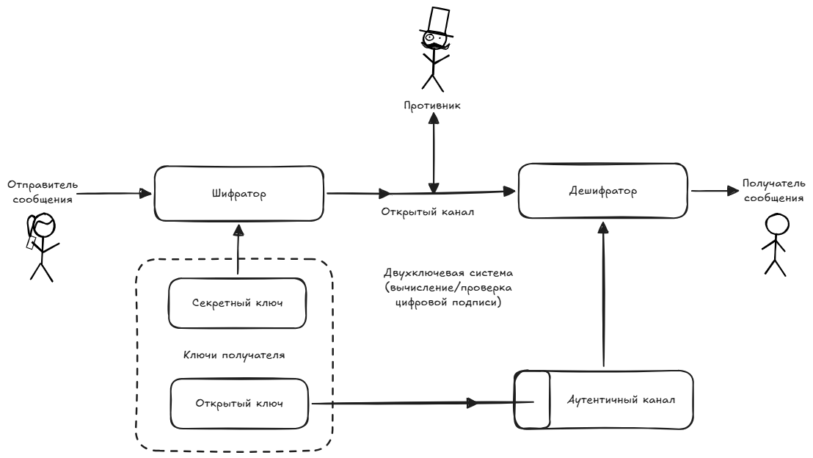
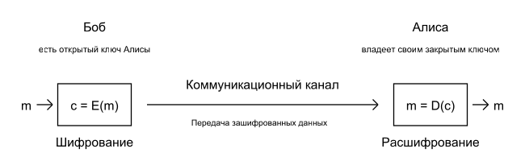

# 2. Асимметричные шифры. RSA.

## Асимметричные шифры
> Пара ключей: открытый (шифрует) и закрытый (расшифровывает). Ассиметричное шифрование решает проблему доверия

В 1970-х годах Уитфильд Диффи и Мартин Хеллман предложили [концепцию](), перевернувшую криптографию. Больше не нужно передавать секретный ключ по открытому каналу.

Открытый (Публичный) ключ находится в свободном доступе и используется любым человеком только для **шифрования** сообщения.

Закрытый (Приватный) ключ хранится в строгой тайне владельцем. Используется исключительно для расшифровки и создания электронной подписи.

> Асимметричная криптография работает и в обратную сторону.

Если зашифровать хеш документа Приватным ключом, любой сможет проверить его с помощью Публичного. Это гарантирует авторство и целостность (неотказуемость).

Примеры алгоритмов:
- Диффи – Хеллман (Diffie – Hellman)
- RSA

## RSA

::: info ℹ️ **RSA** (аббревиатура от фамилий Rivest, Shamir и Adleman) — криптографический алгоритм с открытым ключом, основывающийся на вычислительной сложности задачи факторизации больших полупростых чисел.
:::

Криптостойкость системы основана на сложности решения задачи
факторизации – разложения числа n на множители. Ключи от 1024 до 4096 бит.

|Создание ключа|Шифрование сообщения M|Расшифрование шифртекста C|
|---|---|---|
|  Пара $(e,\ n)$ – открытый ключ. Пара $(d,\ n)$ – закрытый ключ. | $C = M^e\ mod\ n.$ |$M = C^d\ mod\ n.$|

1. Генерируются $p,\ q$ – большие различные случайные секретные простые числа.
2. Вычисляется $n = pq$ – криптомодуль. 
3. Подбирается e – небольшое нечетное число, взаимнопростое с $φ(n) = (p − 1)(q − 1)$. 
4. Вычисляется d из условия $ed \ mod \ φ(n) = 1$.

[Вот тут можно почитать подробнее](https://ru.ruwiki.ru/wiki/RSA)