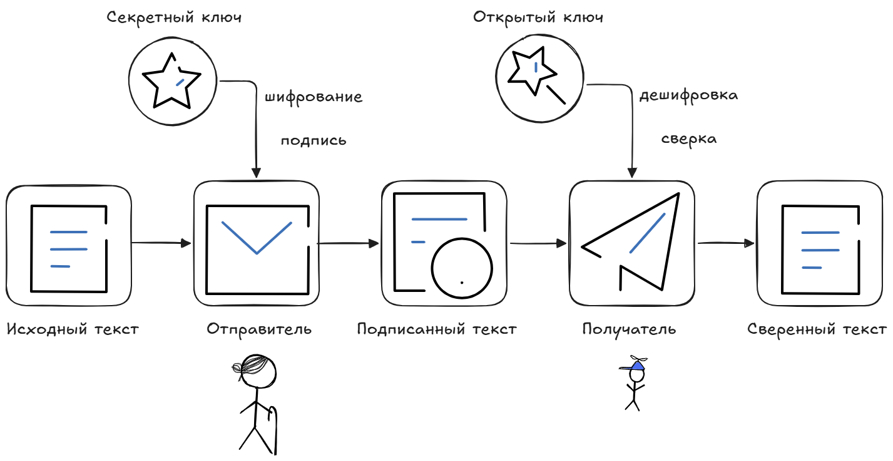

# 5. Цифровая подпись.

## Суть электронной цифровой подписи

::: info ℹ️ Определение
**Электронная цифровая подпись (ЭЦП)** - реквизит электронного документа, полученный в результате криптографического преобразования информации с использованием закрытого ключа подписи.
:::

Перед подписью сообщение хэшируется, а подписывается именно хэш. Это позволяет подписывать сообщения произвольной длины и предотвращает некоторые атаки.

Позвляет:
- проверить отсутствие искажения информации в электронном документе с момента формирования подписи (целостность)
- принадлежность подписи владельцу сертификата ключа подписи (идентификация)
- в случае успешной проверки подтвердить факт подписания электронного документа (неотказуемость)
- признать документ официально действительным (юридическая значимость)

> Здесь перечислены ключевые функции ЭЦП, которые обеспечивают безопасность и юридическую силу цифровых документов в корпоративном и государственном электронном документообороте.

## Шкала угроз для ЭЦП
1. Базовая — известен только открытый ключ.
2. Пассивная — известны подписанные сообщения (но злоумышленник не может их выбирать).
3. Простая — можно выбирать сообщения для подписи до получения ключа (ключ постфактум).
4. Направленная — можно выбирать сообщения при известном открытом ключе.
5. Адаптивная — можно выбирать сообщения на основе ранее полученных подписей (самая опасная).

Метод коллизий позволяет злоумышленнику подделать документ, сохраняя валидность оригинальной ЭЦП.

> [!note] коллизия 
> — это когда для двух разных сообщений $m_1 \neq m_2$ совпадает хэш $h(m_1) = h(m_2)$. Если злоумышленник находит коллизию, он может попросить подписать одно сообщение, а затем применить эту подпись к другому (с тем же хэшем).

## Примеры алгоритмов
- RSA — работает на задаче факторизации.
- DSA / ECDSA — на дискретном логарифмировании (ECDSA — на эллиптических кривых).
- ГОСТ Р 34.10-2012 — использует эллиптические кривые (аналогичен ECDSA).
