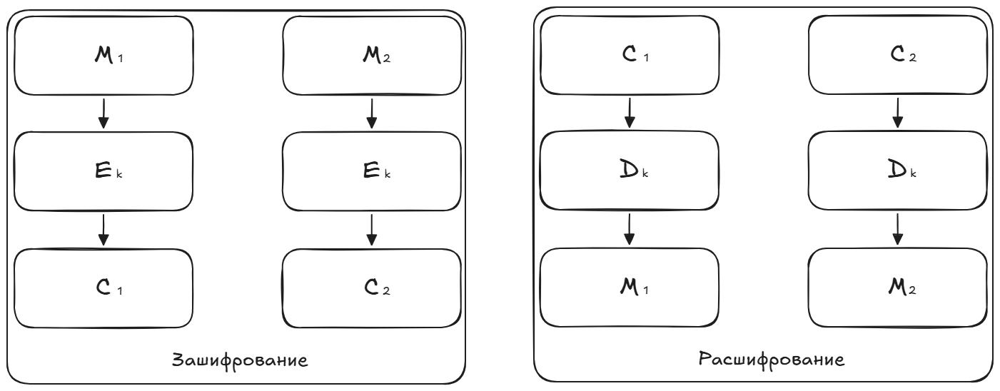
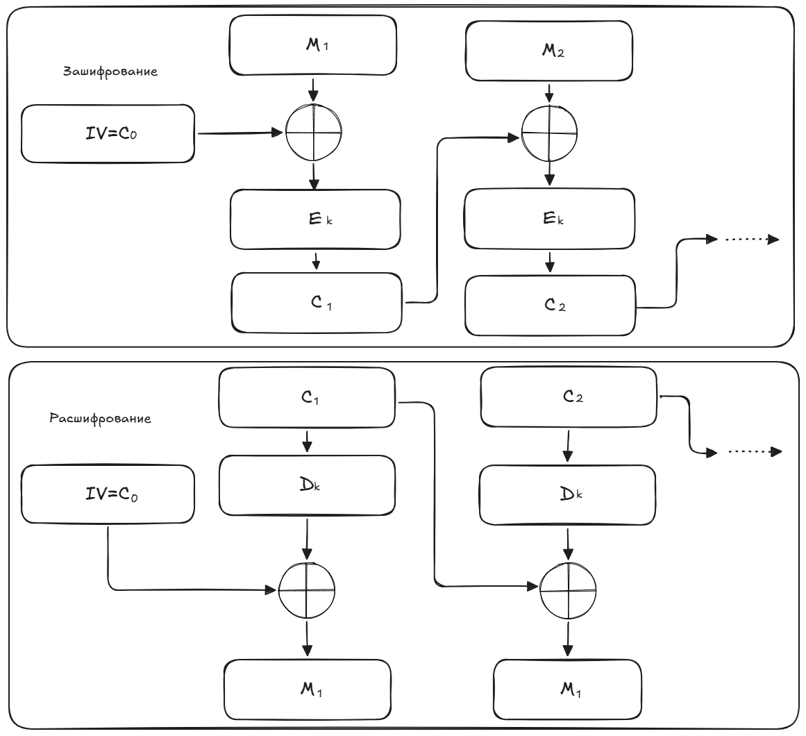
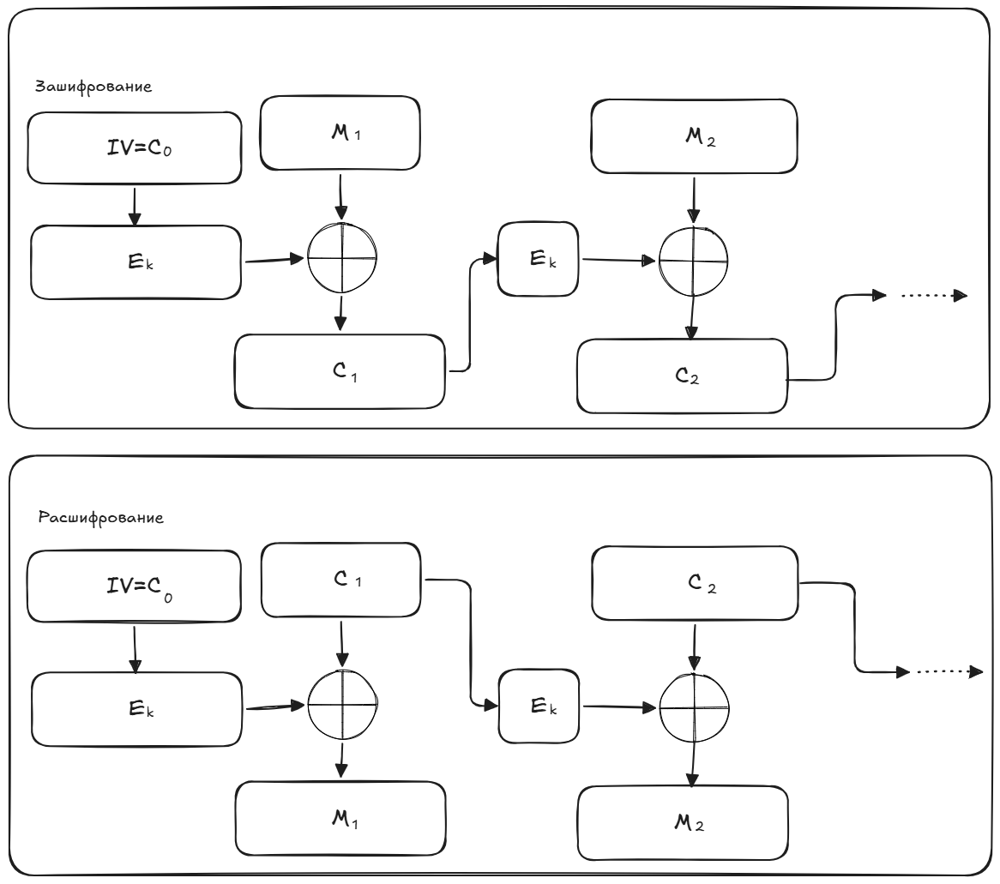

# 6. Блочные шифры и режимы шифрования.

## Зачем нужны блочные шифры?

Необходимо создавать такие шифры, чтобы задача криптоанализа была вычислительно сложной. Для этого нужно маскировать статистические закономерности между символами сообщения и ключа, а также распространять влияние каждого символа ключа на все символы шифртекста.

## Блочное шифрование
Сообщение разбивается на блоки одинаковой длины (64 или 128 бит) и каждый блок шифруется отдельно.

При шифровании каждого блока применяется несколько раундов (циклов) однотипных операций. Дл каждого раунда используется раундовый ключ шифрования, получаемый из основного ключа.

Примеры блочных шифров:
- Блочный шифр "Кузнечик" (входит в стандарт ГОСТ Р 34.10-2015)
- ГОСТ 28147-89 (Магма)
- AES

Основные операции: XOR, подстановки (запутывание) и перестановки (рассеивание).
Длина ключа - от 128 бит.

## Режимы шифрования

**Режим шифрования** - метод применения блочного шифра, позволяющий преобразовать последовательность блоков исходного сообщения в последовательность блоков шифротекста.

Существует много различных режимов шифрования. Рассмотрим изученные на лекциях.

Все обозначения едины:

$M_i$
  — блок открытого текста (i-й по порядку)

$C_i$
  — блок шифротекста

$E_k​$
  — шифрование блочным шифром на ключе k

$D_k$
  — расшифрование

$\oplus$
  — XOR (побитовое исключающее ИЛИ)

$Z_i​$
  — промежуточный блок (гамма)

$IV$
  — начальный вектор (случайный, нетайный, но уникальный для каждого сеанса)

### Режим ECB
Режим электронной кодовой книги (Electronic Codebook)

::: info :information_source: ECB (Electronic Codebook)
 — самый простой режим, где каждый блок открытого текста шифруется независимо. Главный недостаток: одинаковые блоки исходного сообщения превращаются в одинаковые блоки шифротекста, что позволяет злоумышленнику видеть повторяющиеся структуры (например, на изображении). Из-за этого режим практически не применяется для шифрования длинных данных.
:::

Зашифрование: $C_i=E_k(M_i)$.

Расшифрование: $M_i=D_k(C_i)$.

Недостаток: одинаковые блоки исходного сообщения будут преобразованы в одинаковые блоки полученного шифртекста. 

> Если сообщение содержит повторяющиеся фрагменты (например, "YESYESYES"), злоумышленник видит повторения в криптограмме и может делать выводы о содержимом. На изображении проступают контуры исходной картинки.

### Режим CBC
Режим сцепления блоков шифротекста (Cipher Block Chaining)

::: info :information_source: CBC (Cipher Block Chaining)
 — перед шифрованием каждый блок открытого текста складывается XOR с предыдущим блоком шифротекста, а для первого блока используется псевдослучайный начальный вектор. Это обеспечивает, что даже одинаковые блоки исходного сообщения дают разные блоки шифротекста. Ошибка в одном блоке портит соответствующий блок открытого текста полностью и те же самые биты в следующем блоке.
:::

Зашифрование: $C_i = E_k(С_{i-1} \oplus M_i)$.

Расшифрование: $M_i = D_k(C_i) \oplus C_{i-1}$.

## Продвинутые режимы блочного шифрования - режимы гаммирования
Каждый блок открытого текста складывается XOR с уникальным сгенерированным ключом (гаммой). Одно изменение бита на входе меняет все.

### Режим счетчика CTR
Шифрует значение счетчика (уникальное для кажого блока) для генерации гаммы. Главный плюс: позволяет параллельное шифрование потоков данных, обеспечивая огромную скорость без потери безопасности.

### Режим обратной связи CFB
Шифротекст возвращается обратно в алгоритм для шифрования следующего блока.

