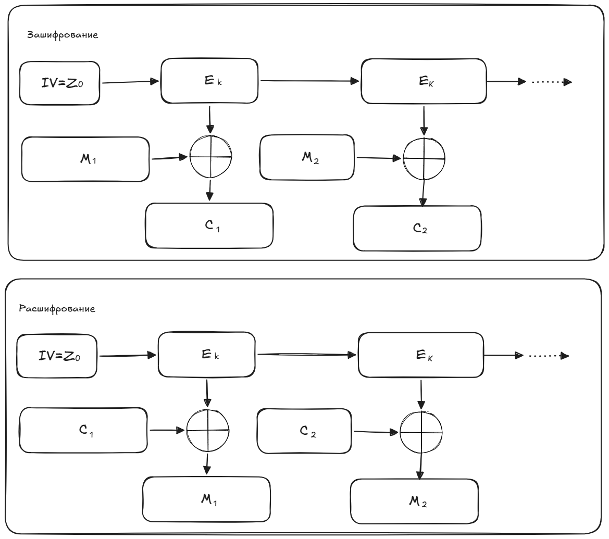

# 6. Блочные шифры и режимы шифрования.

## Зачем нужны блочные шифры?

Необходимо создавать такие шифры, чтобы задача криптоанализа была вычислительно сложной. Для этого нужно маскировать статистические закономерности между символами сообщения и ключа, а также распространять влияние каждого символа ключа на все символы шифртекста.

## Блочное шифрование
Сообщение разбивается на блоки одинаковой длины (64 или 128 бит) и каждый блок шифруется отдельно.

При шифровании каждого блока применяется несколько раундов (циклов) однотипных операций. Дл каждого раунда используется раундовый ключ шифрования, получаемый из основного ключа.

Примеры блочных шифров:
- Блочный шифр "Кузнечик" (входит в стандарт ГОСТ Р 34.10-2015)
- ГОСТ 28147-89 (Магма)
- AES

Основные операции: XOR, подстановки (запутывание) и перестановки (рассеивание).
Длина ключа - от 128 бит.

## Режимы шифрования

**Режим шифрования** - метод применения блочного шифра, позволяющий преобразовать последовательность блоков исходного сообщения в последовательность блоков шифротекста.

> Режимы ECB, CBC, CFB и OFB сами по себе не защищают от подмены данных — нужен отдельный MAC или режим с аутентификацией.

Существует много различных режимов шифрования. Рассмотрим изученные на лекциях.

Все обозначения едины:

$M_i$
  — блок открытого текста (i-й по порядку)

$C_i$
  — блок шифротекста

$E_k​$
  — шифрование блочным шифром на ключе k

$D_k$
  — расшифрование

$\oplus$
  — XOR (побитовое исключающее ИЛИ)

$Z_i​$
  — промежуточный блок (гамма)

$IV$
  — начальный вектор (случайный, нетайный, но уникальный для каждого сеанса)

### Режим ECB
Режим электронной кодовой книги (Electronic Codebook)

::: info :information_source: ECB (Electronic Codebook)
 — самый простой режим, где каждый блок открытого текста шифруется независимо. Главный недостаток: одинаковые блоки исходного сообщения превращаются в одинаковые блоки шифротекста, что позволяет злоумышленнику видеть повторяющиеся структуры (например, на изображении). Из-за этого режим практически не применяется для шифрования длинных данных.
:::

Зашифрование: $C_i=E_k(M_i)$.

Расшифрование: $M_i=D_k(C_i)$.

Недостаток: одинаковые блоки исходного сообщения будут преобразованы в одинаковые блоки полученного шифртекста. 

> Если сообщение содержит повторяющиеся фрагменты (например, "YESYESYES"), злоумышленник видит повторения в криптограмме и может делать выводы о содержимом. На изображении проступают контуры исходной картинки.

### Режим CBC
Режим сцепления блоков шифротекста (Cipher Block Chaining)

::: info :information_source: CBC (Cipher Block Chaining)
 — перед шифрованием каждый блок открытого текста складывается XOR с предыдущим блоком шифротекста, а для первого блока используется случайный начальный вектор. Это обеспечивает, что даже одинаковые блоки исходного сообщения дают разные блоки шифротекста. Ошибка в одном блоке портит соответствующий блок открытого текста полностью и те же самые биты в следующем блоке.
:::

Зашифрование: $C_i = E_k(С_{i-1} \oplus M_i)$.

Расшифрование: $M_i = D_k(C_i) \oplus C_{i-1}$.

### Режим CFB
Режим обратной связи по шифротексту (Cipher Feedback)

::: info :information_source: CFB (Cipher Feedback)
 — превращает блочный шифр в потоковый: шифруется предыдущий блок шифротекста, а результат складывается XOR с текущим блоком открытого текста. Расшифрование использует ту же операцию шифрования, что и шифрование. Ошибка в одном блоке шифротекста распространяется на два блока открытого текста.
:::

Зашифрование: $C_i = M_i \oplus E_k(C_{i-1})$.

Расшифрование: $M_i = C_i \oplus E_k (C_{i-1})$.

### Режим OFB
Режим обратной связи по выходу (Output Feedback)

::: info :information_source: OFB (Output Feedback)
 — генерирует гамму независимо от открытого текста, многократно шифруя начальный вектор: очередной блок гаммы получается шифрованием предыдущего. Затем гамма складывается XOR с открытым текстом. Ошибка в одном блоке шифротекста портит только один блок открытого текста, но потеря синхронизации невосстановима.
:::

Зашифрование: 

$Z_i = E_k(Z_{i-1})$

$C_i = M_i \oplus Z_i$.

Расшифрование: 

$Z_i = E_k(Z_{i-1})$

$M_i = C_i \oplus Z_i$.
