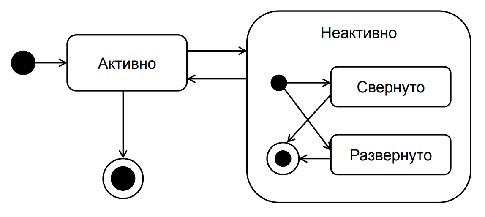

# 11. Элементы диаграммы состояний

## Состояние (State)
- Задаётся набором значений атрибутов класса/объекта.
- Изменение значений атрибутов → изменение состояния.
- **Графически**: прямоугольник со скруглёнными углами.  
  Может быть:
  - только с именем состояния;
  - разделён на две секции: имя состояния + внутренние действия: <метка> / <выражение действия>.

### Типы внутренних действий:
| Тип | Значение |
|------|-----------|
| `entry` | выполняется при входе в состояние |
| `exit` | выполняется при выходе из состояния |
| `do` | выполняется всё время нахождения в состоянии |
| `include` | ссылка на подавтомат |

## Начальное и конечное состояния
| Состояние | Обозначение |
|-----------|-------------|
| **Начальное** | закрашенный кружок (из него только выходит переход) |
| **Конечное** | закрашенный кружок внутри окружности (в него только входит переход) |

## Переход (Transition)
- Сплошная линия со стрелкой → целевое состояние.
- **Может быть помечен**:  
  `событие [сторожевое условие] / действие`
- Переход происходит, если:
  1. событие наступило;
  2. сторожевое условие истинно.

## Составное состояние
Составное состояние состоит из вложенных в него подсостояний

## Вложенные состояния
| Тип | Описание |
|------|-----------|
| **Последовательные подсостояния** | в каждый момент времени объект находится ровно в одном подсостоянии |
| **Параллельные подсостояния** | объект одновременно находится в нескольких подсостояниях (разделяются пунктирной линией) |

