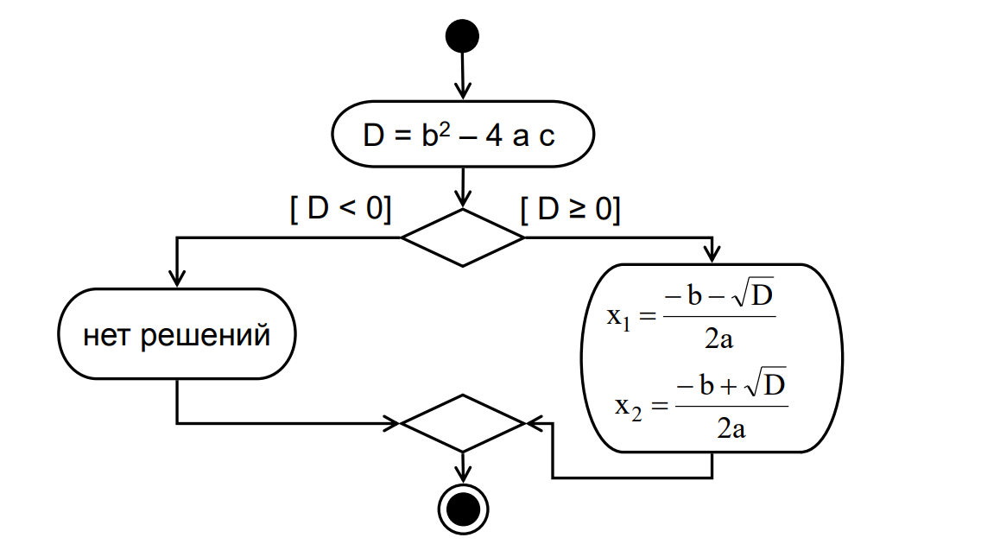
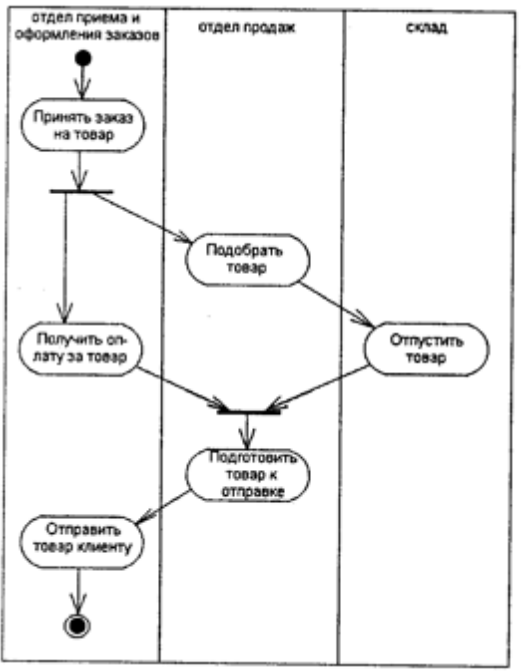

# 14. Элементы диаграммы деятельности

- Действие – операция, выражение, вычисления и т.д.
- Начало алгоритма
- Конец алгоритма
- Переход – срабатывает сразу после завершения действия
- Ветвление – разделение на альтернативные ветви
- Соединение – объединение альтернативных ветвей
- Разделение – распараллеливание действий
- Согласование – переход к следующему действию после окончания всех согласуемых действий
- Дорожка – исполнитель действий

