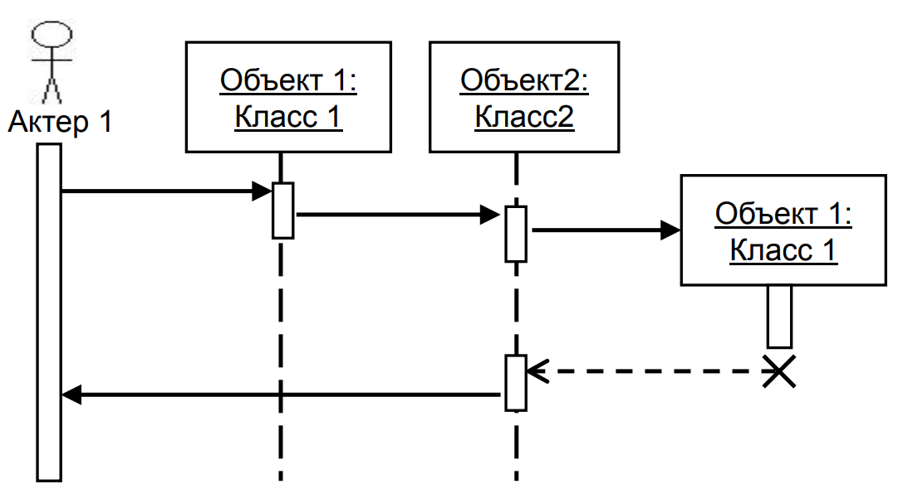
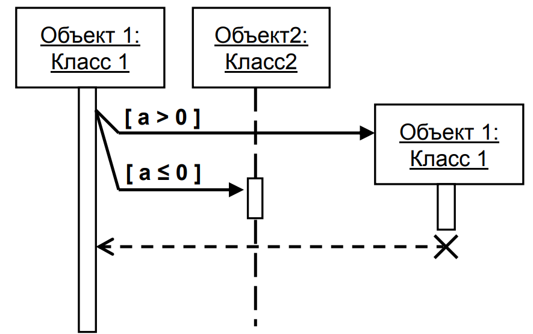

# 16. Элементы диаграммы последовательности

- Объект - непосредственно участвуют во взаимодействии и не показываются возможные статические ассоциации с другими объектами
- Актёр - инициатор взаимодействия в системе
- Линия жизни - период времени, в течение которого объект существует в системе
- Фокус управления - в активном состоянии, непосредственно выполняя определенные действия или в состоянии пассивного ожидания сообщений от других объектов.
- Сообщение - законченный фрагмент информации, который отправляется одним объектом другому
- Уничтожение объекта - соответствующего объекта в системе уже нет, и этот объект должен быть исключен из всех последующих взаимодействий.

