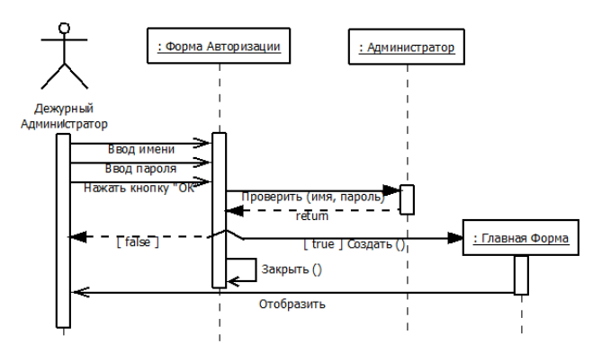

# 17. Типы сообщений диаграммы последовательности

## Вызов процедуры
Один объект вызывает процедуру и ожидает, пока она не закончится.

Вызов является наиболее распространенным сообщением и используется для вызова процедур, выполнения операций или обозначения отдельных вложенных потоков управления.

Такое сообщение является **синхронным**.

## Асинхронное сообщение
Объект передает сообщение и продолжает выполнять свою деятельность, не ожидая ответа. Передается в произвольный момент.

## Возврат из вызова процедуры
Объект передает сообщение об окончании выполнения процедуры.

## Стандартные сообщения
- «call» (вызвать) – сообщение, требующее вызова операции или процедуры принимающего объекта;
- «return» (возвратить) – сообщение, возвращающее значение выполненной операции или процедуры вызвавшему ее объекту;
- «create» (создать) – сообщение, требующее создания другого объекта для выполнения определенных действий;
- «destroy» (уничтожить) – сообщение с явным требованием уничтожить соответствующий объект;
- «send» (послать) – обозначает посылку другому объекту некоторого сигнала, который асинхронно инициируется одним объектом и принимается (перехватывается) другим. Отличие сигнала от сообщения заключается в том, что сигнал должен быть явно описан в том классе, объект которого инициирует его передачу.

