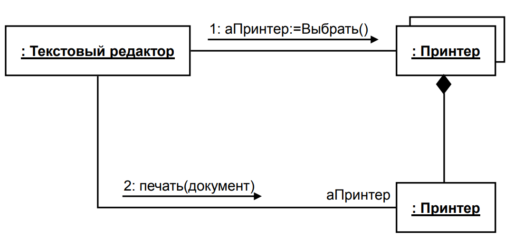

# 19. Элементы диаграммы коммуникации

- Объект
- Ассоциация
- Сообщение

На диаграмме кооперации в виде прямоугольников изображаются участвующие во взаимодействии **объекты**, указываются **ассоциации**
между объектами в виде различных соединительных линий. 

Дополнительно могут быть изображены **динамические связи** – потоки сообщений, которые представляются в виде соединительных линий между объектами, над которыми располагается стрелка с указанием направления, имени сообщения и порядкового номера в общей последовательности инициализации сообщений.

