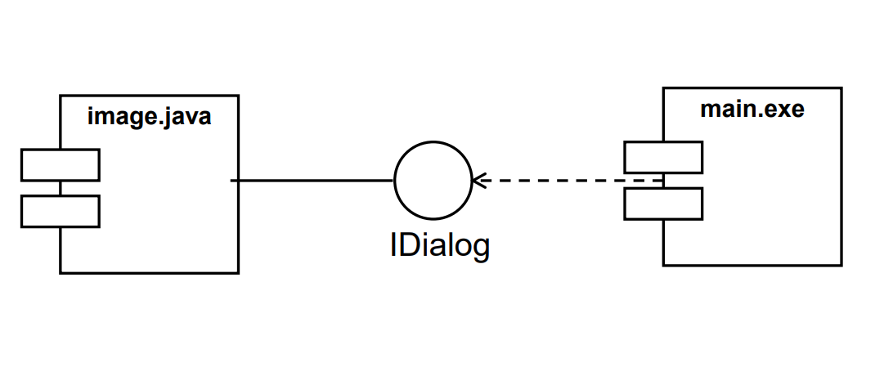
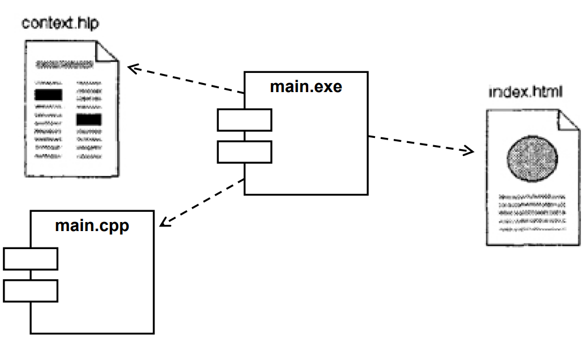
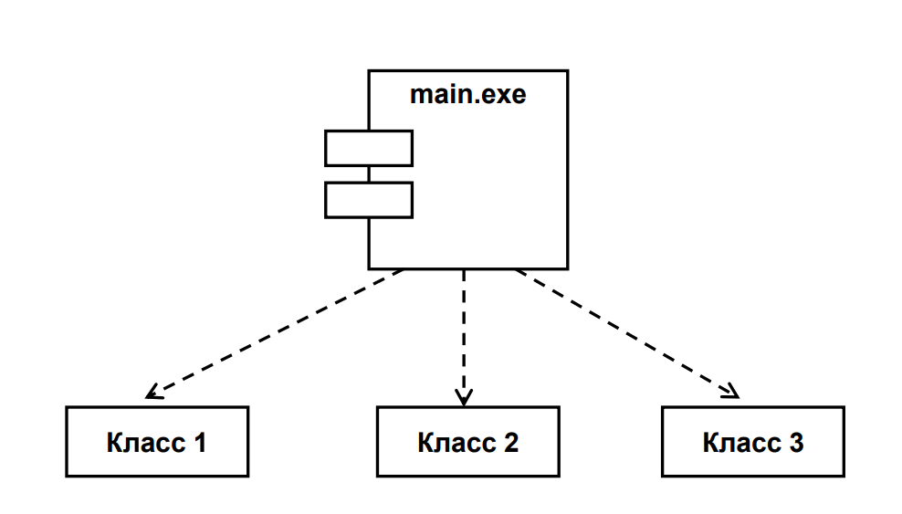
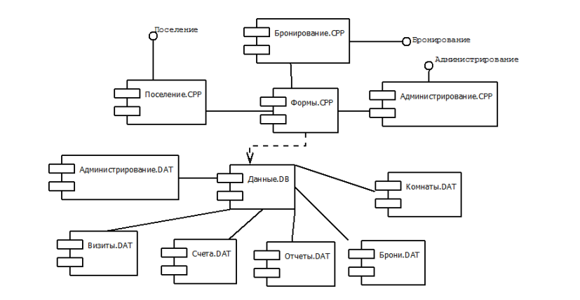

# 21. Элементы диаграммы компонентов

## Интерфейс

Инструмент взаимодействия между компонентами.

Изображается как «кружок» (лоллипоп) — предоставляемый интерфейс

Компонент может:
- предоставлять интерфейс (реализовывать его)
- требовать интерфейс (использовать)

## ==Компонент== соответствует файлу. 

Компонентом может быть любой крупно модульный объект: 
- общая подсистема, 
- бинарный исполняемый файл, 
- готовая к использованию система, 
- объектно-ориентированное приложение. 

## Реализация
Отношение между компонентом и классами (или интерфейсами), которое показывает, что компонент предоставляет функциональность этих классов физически. Компонент реализует один или несколько классов. Графически изображается пунктирной линией с треугольной стрелкой от компонента к классу.

## Отношения взаимозависимости
Пунктирные стрелки, соединяющие модули, показывают ==отношения взаимозависимости==, аналогичные тем, которые имеют место при компиляции исходных текстов программ.
На диаграмме компонентов могут быть представлены **отношения взаимозависимости** между компонентами и реализованными в них классами. Эта информация имеет важное значение для обеспечения согласования логического и физического представлений модели системы.

