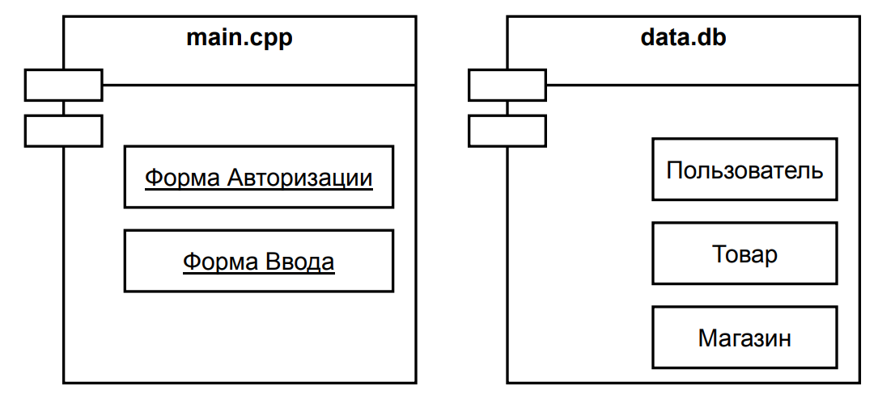
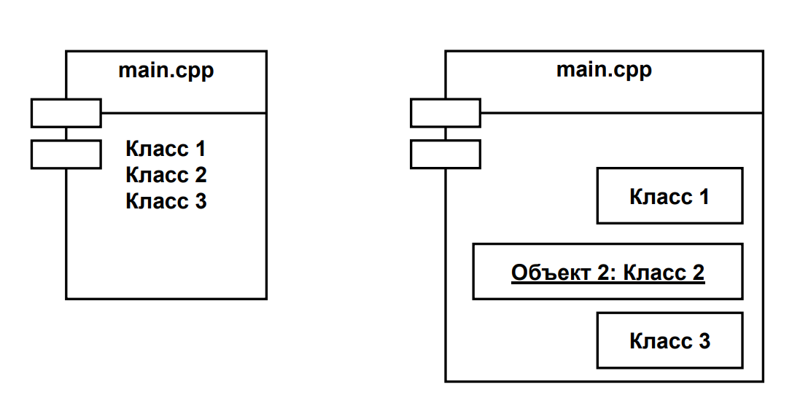

# 22. Как на диаграмме компонентов отображается реализация классов, интерфейсов?

- Графическое «вкладывание» - Прямоугольник компонента с классами/интерфейсами внутри

- Пунктир + треугольная стрелка

