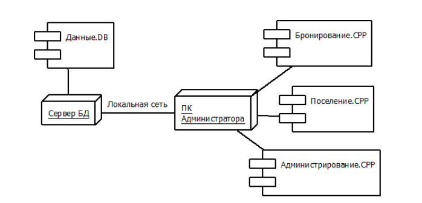

# 24. Элементы диаграммы топологии

1. Узел (Node)
Физический элемент системы с вычислительным ресурсом.

Примеры: компьютер, сервер, датчик, принтер, модем, камера, сканер.

Графически: трёхмерный куб (прямоугольный параллелепипед).

- Процессор (Processor) — частный случай узла
Узел, способный выполнять программное обеспечение (имеет CPU).

- Устройство (Device) — частный случай узла
Физическое устройство без вычислительной мощности (или со специфичной).

2. Артефакт (Artifact)
Физический файл/продукт разработки: *.exe, *.jar, *.dll, *.xml, скрипт, база данных, документ.

Размещается внутри узла, показывая, что артефакт развёрнут на этом узле.

3. Связи между узлами
Линия связи (обычно сплошная) — физическое соединение (Ethernet, USB, шина, беспроводная связь).

