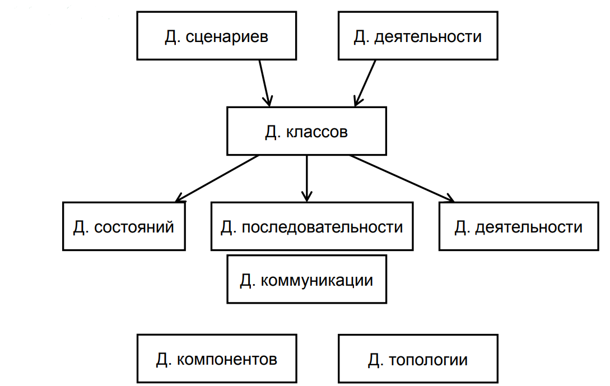
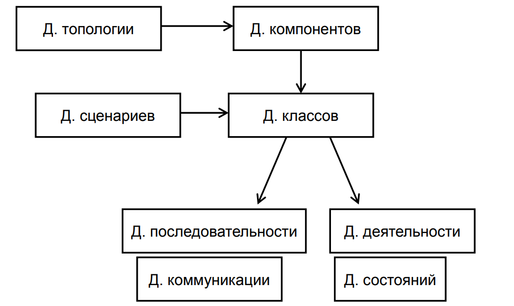

# 25. Последовательность разработки диаграмм UML

## От функций ИС

1. Диаграммы сценариев и деятельности
2. Диаграмма классов
3. Диаграммы состояний, последовательности и коммуникации, деятельности
4. Диаграммы компонентов и топологии

## От физической реализации

1. Диаграмма топологии и диаграмма компонентов
2. Диаграмма сценариев
3. Диаграмма классов
4. Диаграммы последовательности и коммуникации
5. Диаграммы деятельности и состояний

