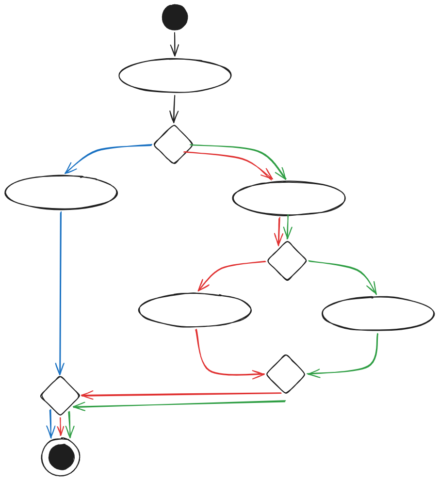
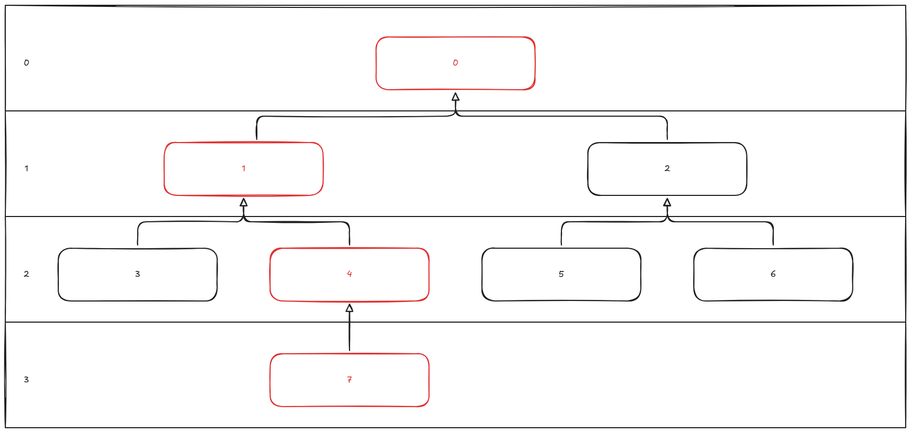
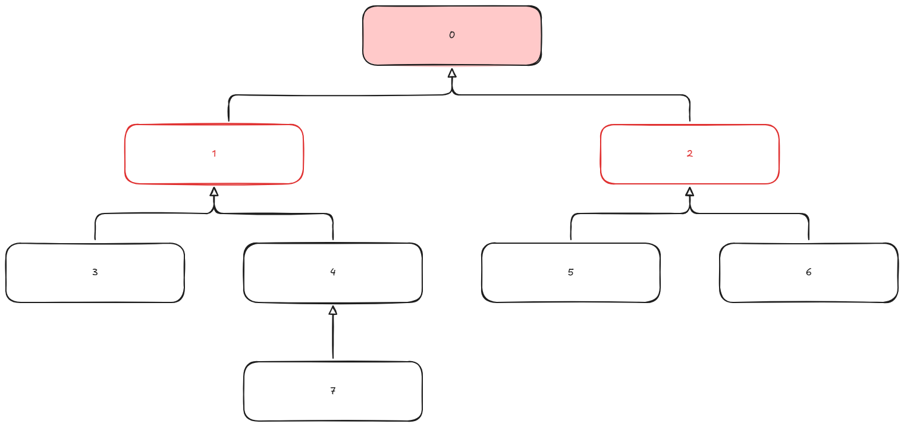
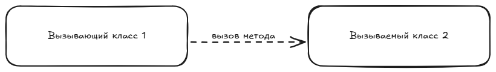
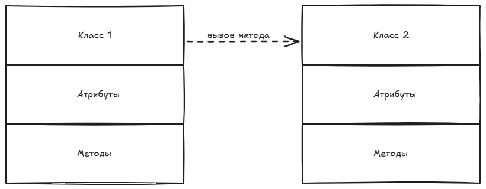

# 29. Метрики Чидамбера и Кемерера

- взвешенные методы на класс
- высота дерева наследования
- количество детей
- сцепление между классами объектов
- отклик для класса
- недостаток связности в методах

## Взвешенные методы на класс

$$ WMC = \overset{n}{\underset{i=1}{\sum}}c_i $$

Как считать? Посчитаем количество путей, по которым можем пройти (и негативных, и позитивных)

::: danger :1234: Пример

> В этом примере мы получаем 3 пути: синий, красный и зелёный. Значит, сложность метода класса = 3.
:::
## Высота дерева наследования (DIT)

Построили диаграмму классов, где указали отношение обобщения (количество уровней <highlight>потомков</highlight>). 

В потомках могут переопределяться методы.

Чем выше дерево, тем более специфичнее листья.

Рекомендуют 7 уровней делать $\pm$ 2.

::: danger :1234: Пример

> В этом примере высота дерева = 3.
:::

## Количество потомков (NOC)

Лучше, если ИС будет представлять из себя лес, а не одно высокое дерево.

Больше потомков -> больше специализация

::: danger :1234: Пример

> В этом примере у нулевого класса всего 2 потомка - 1 и 2. Мы считаем <highlight>прямых</highlight> потомков, а не всех.
:::

## Сцепление между классами (СВО)

Количество вызовов (обращений) методов другого класса.

Это описывается зависимостью чаще всего.

::: danger :1234: Пример

> Тут схематично изображено, что вызывается 1 метод.
:::

## Отклик для класса (RFC)

Множество методов класса + множество методов других классов вызываемых из этого класса (сцепление из предыдущего пункта)

::: danger :1234: Пример

> Тут схематично изображено, что вызывается 1 метод, так что для класса 1 нужно посчитать все его методы и один вызов метода класса 2.
:::

## Недостаток связности в методах (LCOM)

Показывает, насколько методы не связаны друг с другом (через атрибуты этого же класса)

$$LCOM = \begin{cases} {\overline{A} - A, \overline{A} > A ,} \\ {0, \overline{A} \leq A} \end{cases}$$

$A = |I_{ij}|: I_i \bigcap I_j \neq \varnothing$

$\overline{A} = |I_{ij}|: I_i \bigcap I_j = \varnothing$

$\overline{A}$ - количество пар методов без общих переменных

A - количество пар методов с общими экземплярными переменными

$I_j$ - набор экземплярных переменных используемых методом j

::: danger :1234: Пример
|Класс|
|---|
|a   b   c   x   y   m   n|
|$M_1(a,b)$   $M_2(a,c)$   $M_3(x,y)$   $M_4(m,n)$|

Тогда $A = 1,\ \overline{A} = 5,\ LCOM = 5-1 = 4$
:::