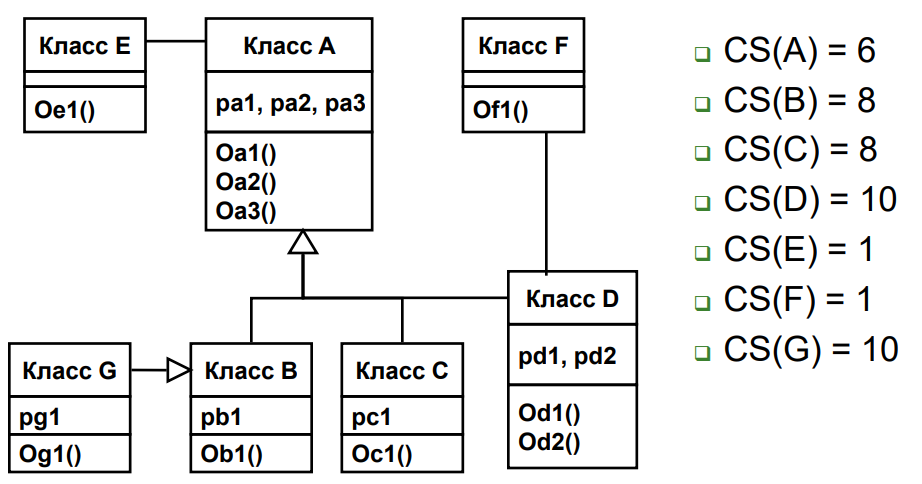
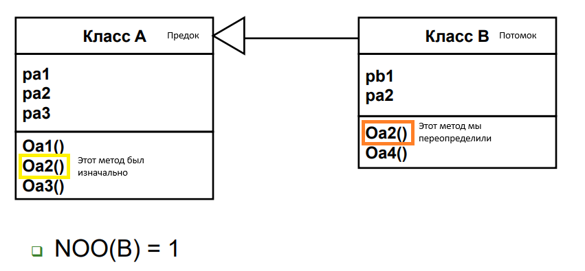
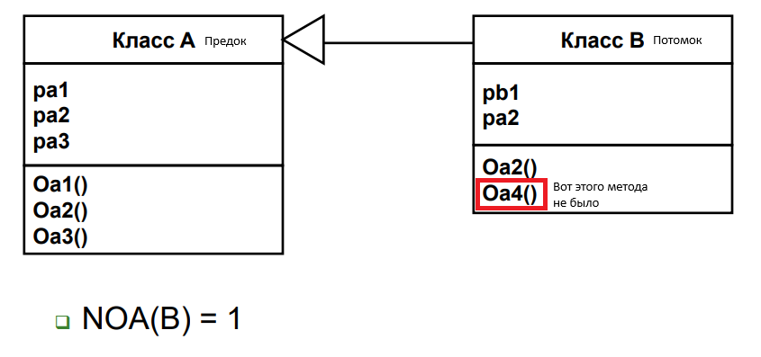
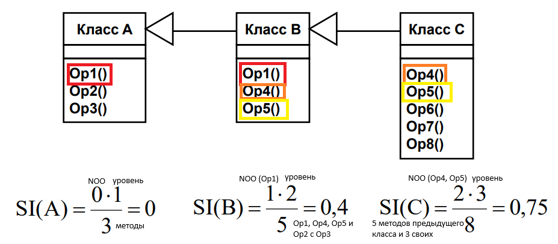
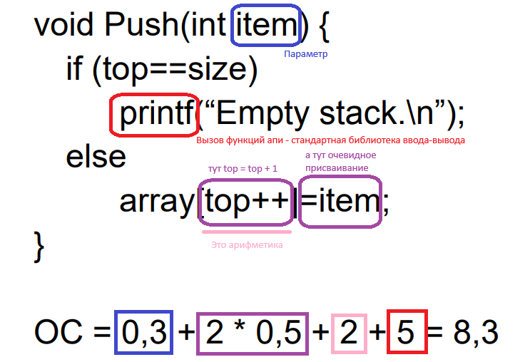

# 30. Метрики Лоренца и Кидда
- размер класса
- количество операций, переопределенных подклассом
- количество операций, добавленных подклассом
- индекс специализации
- средний размер операции
- сложность операции
- среднее количество параметров на операцию
- количество описаний сценариев
- количество ключевых классов
- количество подсистем

## Размер класса
Количество операций (методов) + количество свойств (полей)

Вместе с наследуемыми из родительского класса

## Количество операций, переопределенных подклассом (NOO)

Переопределением называют случай, когда подкласс замещает операцию, унаследованную от предка, своей собственной версией.

## Количество операций, добавленных подклассом (NOA)

Подклассы специализируются добавлением приватных операций и свойств. С ростом NOA подкласс удаляется от абстракции предка.

## Индекс специализации

Специализация достигается добавлением, удалением или переопределением операций:

$SI = (NOO * уровень) / M_{общ}$
- уровень - из иерархии наследования, начинается с 1
- M_общ - общее количество методов класса

## Средний размер операции ($OS_{avg}$)
Количество строк в программе

## Сложность операции (ОС)

| Параметр                | Вес |
| ----------------------- | --- |
| Вызовы функций API      | 5   |
| Присваивания            | 0.5 |
| Арифметическая операция | 2   |
| Сообщение с параметрами | 3   |
| Параметры               | 0.3 |
| Временные параметры     | 0.5 |

## Среднее количество параметров на операцию ($NP_{avg}$)

NPavg = общее количество методов / ∑(количество параметров каждого метода)
​
Допустим, у тебя есть 4 метода:

- void save(String id) — 1 параметр;
- void update(String id, String name, int age) — 3 параметра;
- void delete() — 0 параметров;
- void list(String filter, boolean active) — 2 параметра.

Считаем:
- Сумма параметров: 1+3+0+2=6;
- Количество методов: 4;

NPavg=6/4=1,5.

## Количество описаний сценариев (NSS)
- количество классов, необходимых для реализации требований

## Количество ключевых классов (NKC)

Допустим, система «учёт заказов в интернет‑магазине»:

Ключевые классы: Order, Customer, Product, Cart, ShippingRule.

Вспомогательные: OrderController, OrderRepository, JsonFormatter, Logger, Button.

Тогда NKC = 5

## Количество подсистем (NSUB)

Подсистема — это относительно независимый фрагмент системы, который:
- реализует законченный набор функций (или одну крупную функциональную область);
- имеет чёткие интерфейсы взаимодействия с другими частями системы;
- может разрабатываться и тестироваться отдельно (в идеале — даже развёртываться независимо).

Примеры подсистем в типичном веб‑приложении: «Авторизация и управление пользователями», «Каталог товаров», «Корзина и оформление заказа», «Отчётность», «Администрирование».