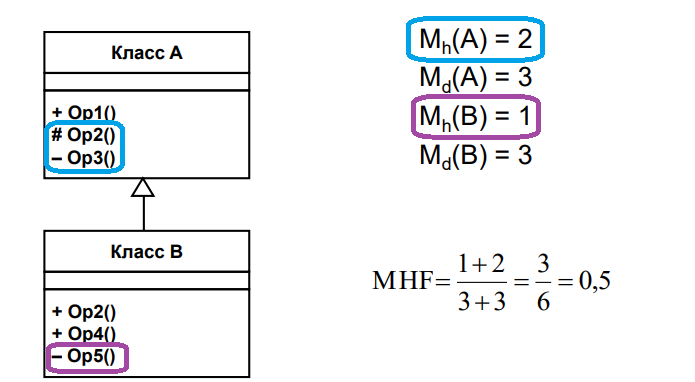
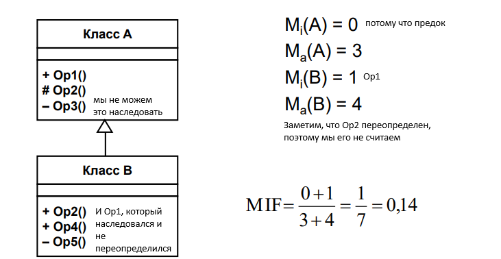
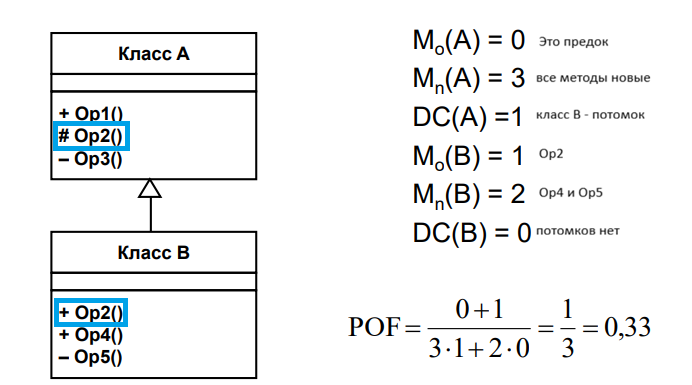

# 31. Метрики Абреу
- фактор закрытости метода
- фактор закрытости свойства
- фактор наследования метода
- фактор наследования свойства
- фактор полиморфизма
- фактор сцепления

## Фактор закрытости метода MHF (Method Hiding Factor)

Введем обозначения:

- Мv (Сi) — количество видимых методов в классе Сi (интерфейс класса);
- Мh (Сi) — количество скрытых методов в классе Сi (реализация класса);
- Мd (Сi) = Мv (Сi) + Мh (Сi) — общее количество методов, определенных в классе С, (унаследованные методы <highlight>не учитываются</highlight>).

Тогда формула метрики МНF примет вид:

$$MHF = \dfrac{\overset{TC}{\underset{i=1}{\sum}}M_h(C_i)}{\overset{TC}{\underset{i=1}{\sum}}M_d(C_i)}$$

где ТС — количество классов в системе.

## Фактор закрытости свойства AHF (Attribute Hiding Factor)

Введем обозначения:

- Аv (Сi) — количество видимых свойств в классе Сi (интерфейс класса);
- Ah(Ci) — количество скрытых свойств в классе Сi (реализация класса);
- Ad(Ci) = Аv (Сi) + Ah(Ci) — общее количество свойств, определенных в классе Сi (унаследованные свойства не учитываются).

Тогда формула метрики AHF примет вид:

$$AHF = \dfrac{\overset{TC}{\underset{i=1}{\sum}}A_h(C_i)}{\overset{TC}{\underset{i=1}{\sum}}A_d(C_i)}$$

где ТС — количество классов в системе.

## Фактор наследования метода MIF (Method Inheritance Factor)

Введем обозначения:

- Mi (Сi) — количество унаследованных и не переопределенных методов в классе Сi - метод, для которого в подклассе нет собственной реализации с той же сигнатурой.
- Ma(Сi) — общее количество методов, доступных в классе Сi.

Тогда формула метрики MIF примет вид:

$$MIF = \dfrac{\overset{TC}{\underset{i=1}{\sum}}M_i(C_i)}{\overset{TC}{\underset{i=1}{\sum}}M_a(C_i)}$$

Числителем MIF является сумма унаследованных (и не переопределенных) методов во всех классах рассматриваемой системы. Знаменатель MIF — это общее количество доступных методов (локально определенных и унаследованных) для всех классов.

## Фактор наследования свойства AIF (Attribute Inheritance Factor)

Введем обозначения:

- Аi (Сi) — количество унаследованных и не переопределенных свойств в классе Сi;

- Аa(Сi) — общее количество свойств, доступных в классе Сi.

Тогда формула метрики AIF примет вид:

$$AIF = \dfrac{\overset{TC}{\underset{i=1}{\sum}}A_i(C_i)}{\overset{TC}{\underset{i=1}{\sum}}A_a (C_i)}$$

## Фактор полиморфизма POF (Polymorphism Factor)

Введем обозначения:

- M0(Сi) — количество унаследованных и переопределенных методов в классе Сi;

- Mn(Сi) — количество новых (не унаследованных и переопределенных) методов в классе Сi;

- DC(Сi) — количество потомков класса Сi

Тогда формула метрики POF примет вид:

$$POF = \dfrac{\overset{TC}{\underset{i=1}{\sum}}M_0(C_i)}{\overset{TC}{\underset{i=1}{\sum}}M_n(C_i)\times DC(C_i)}$$

## Фактор сцепления COF (Coupling Factor)

Если наличие отношения «клиент-поставщик» (класс-клиент содержит но меньшей мере одну не унаследованную ссылку на свойство или метод класса-поставщика) определять по выражению:

is_client(Cc, Cs) = $\begin{cases}
    1,\ C_c => C_s \bigcap C_c \neq C_s, \\
    0,\ else
\end{cases}$

то формула для вычисления метрики COF примет вид:

$$COF = \dfrac{\overset{TC}{\underset{i=1}{\sum}}[\overset{TC}{\underset{j=1}{\sum}}is_client(C_i,C_j)]}{TC^2-TC}$$