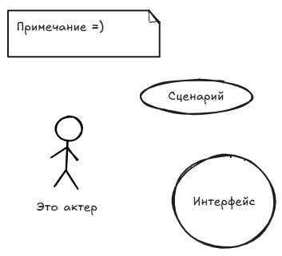

# 4. Основные элементы диаграммы сценариев

1. ==Сценарий==
   -  Фрагмент поведения ИС без раскрытия его внутренней структуры
   -  Сервис, который ИС предоставляет пользователю (актёру)
2. ==Актёр==
   - Любая внешняя по отношению к моделируемой ИС сущность, которая взаимодействует с системой и использует ее функциональные возможности для достижения определенных целей
3. ==Интерфейс==
   - Совокупность операций, которые обеспечивают необходимый набор сервисов для актёра
4. ==Примечание==
   - Предназначено для включения в модель произвольной текстовой информации, имеющей непосредственное отношение к контексту разрабатываемого проекта

**Отображения**:

