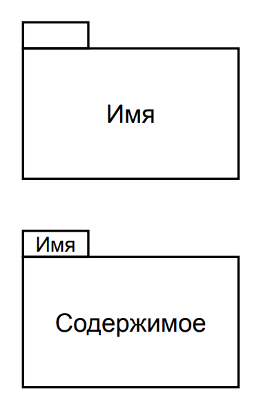
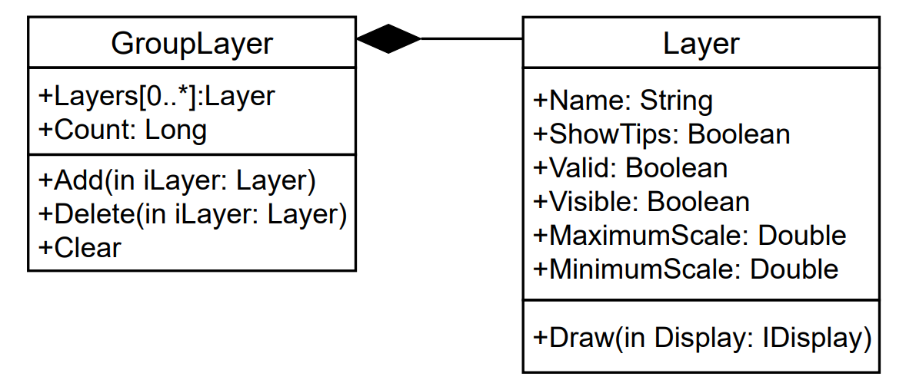
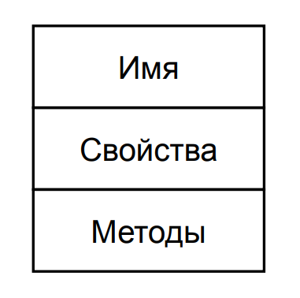
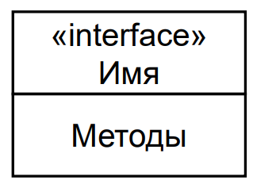
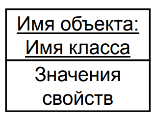

# 7. Основные элементы диаграммы классов

## ==Пакет== - способ организации элементов модели. Каждый элемент модели принадлежит только одному пакету.

## ==Класс== - именованное описание совокупности объектов с общими атрибутами, операциями, связями и семантикой, поведением и отношениями с объектами из других классов. 

Класс на диаграмме показывается в виде прямоугольника, разделенного на три области. В верхней содержится название класса, в средней – описание атрибутов (свойств), в нижней – названия операций – услуг, предоставляемых объектами этого класса.

У каждого класса должно быть имя (текстовая строка), уникально отличающее его от всех других классов. Рекомендуется в качестве имен классов использовать существительные, записанные по практическим соображениям без пробелов. Имена классов образуют словарь предметной области.

### ==Свойство==: <квантор видимости> <имя> [<кратность>] : <тип> = <исходное значение>
      1. Квантор видимости
         1. (+) общедоступный/открытый (public) – атрибут виден для любого другого класса (объекта);
         2. (#) защищенный (protected) – атрибут виден для потомков данного класса;
         3. (-) закрытый (private) – атрибут не виден внешними классами (объектами) и может использоваться только объектом, его содержащим
      2. Кратность - количество атрибутов данного типа, входящих в состав класса: [нижняя_граница1 .. верхняя_граница1, …]
      3. Тип - выражение, семантика которого определяется языком спецификации модели
      4. Исходное значение - некоторое начальное значение для соответствующего атрибута в момент создания отдельного экземпляра класса

### ==Метод== <квантор видимости><имя> (<список параметров>): <тип возвращаемого значения>
      1. Квантор видимости
         1. (+) общедоступный/открытый (public) – атрибут виден для любого другого класса (объекта);
         2. (#) защищенный (protected) – атрибут виден для потомков данного класса;
         3. (-) закрытый (private) – атрибут не виден внешними классами (объектами) и может использоваться только объектом, его содержащим
      2. Параметр <вид><имя> : <тип> = <значение по умолчанию>
         1. Вид:
            1. in – входной параметр
            2. out – выходной параметр
            3. inout – одновременно входной и выходной параметр

## ==Интерфейс== - набор операций, которые задают некоторые аспекты поведения класса и представляют его для других классов

## ==Объект== - отдельный экземпляр класса, который создается в процессе выполнения программы. Объект может иметь имя и конкретные значения свойств.

