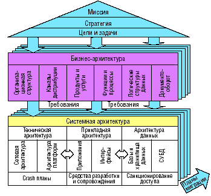
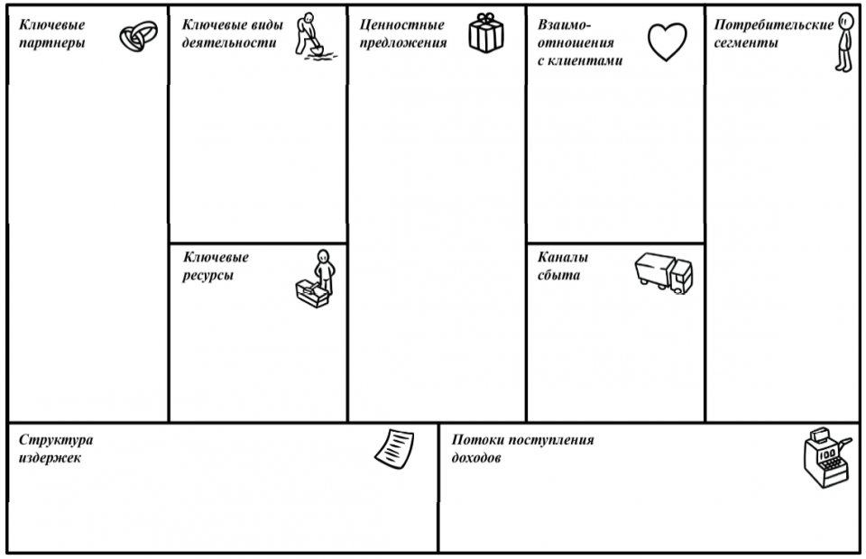
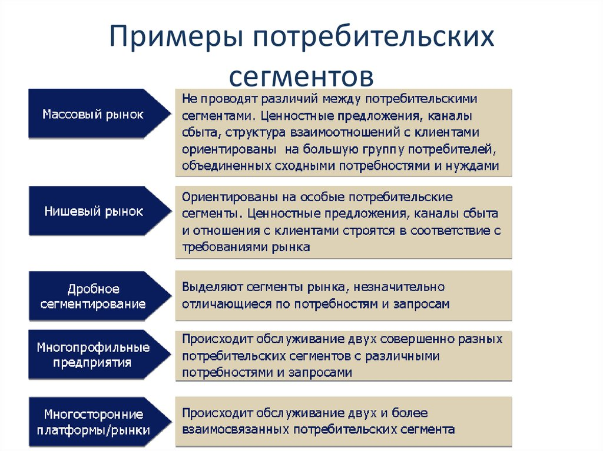
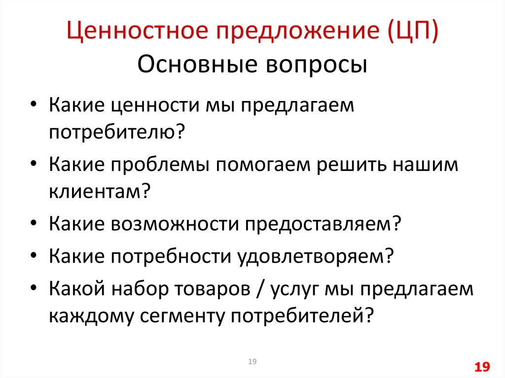

# 2. Бизнес-архитектура

## Архитектура предприятия
::: info Архитектура предприятия

Рассмотрение системы сверху вниз в попытках декомпозировать.
:::

**Архитектура** - моделирование текущего состояния предприятия.

1. Миссия
2. Стратегия
3. Цели и задачи
4. Бизнес-архитектура:
   1. Потребительские сегменты
   2. 
5. Системная архитектура

## Модель Александра Остервальдера

Бизнес-архитектура

|Блоки модели Остервальдера|Что это такое|
|---|---|
|Ключевые партнеры||
|Ключевые виды деятельности||
|Ключевые ресурсы||
|Ценностное предложение||
|Взаимоотношения с клиентами||
|Каналы сбыта||
|Потребительские сегменты|Определяем, кто наш потребитель, кому предлагаем товар/услугу|
|Структура издержек||
|Потоки поступления доходов||

### Потребительские сегменты

- Массовый рынок
- Нишевый рынок
- Дробное сегментирование
- Многопрофильные предприятия
- Многосторонние платформы/рынки

Что важно знать о рынке:
- Географическое местоположение
- Средний балл ЕГЭ
- Возраст
- Профессиональные интересы
- Материальные способности# 2. Бизнес-архитектура

## Архитектура предприятия
::: info Архитектура предприятия

Рассмотрение системы сверху вниз в попытках декомпозировать.
:::

**Архитектура** - моделирование текущего состояния предприятия.

1. Миссия
2. Стратегия
3. Цели и задачи
4. Бизнес-архитектура:
   1. Потребительские сегменты
   2. Ценностное предложение
5. Системная архитектура

## Модель Александра Остервальдера

Бизнес-архитектура

|Блоки модели Остервальдера|Что это такое|
|---|---|
|Ключевые партнеры||
|Ключевые виды деятельности||
|Ключевые ресурсы||
|Ценностное предложение|Товары или услуги, которые представляют ценность для определенного потребительского сегмента|
|Взаимоотношения с клиентами||
|Каналы сбыта||
|Потребительские сегменты|Определяем, кто наш потребитель, кому предлагаем товар/услугу|
|Структура издержек||
|Потоки поступления доходов||

### Потребительские сегменты

Может быть один или несколько сегментов:

- Массовый рынок
- Нишевый рынок
- Дробное сегментирование
- Многопрофильные предприятия
- Многосторонние платформы/рынки

*Что важно знать о рынке*:
- Географическое местоположение
- Средний балл ЕГЭ (ХЫ)
- Возраст
- Профессиональные интересы
- Материальные способности

### Ценностное предложение
Определить товары или услуги, которые представляют ценность для определенного потребительского сегмента.

Ценностные предложения представляют собой совокупность преимуществ товаров (услуг), которые компания готова предложить потребителю.

Преимущества количественного или качественного характера:
- Новизна
- Бренд/статус
- Производительность
- Цена
- Изготовление на заказ
- Уменьшение расходов
- Делать свою работу
- Снижение риска
- Дизайн
- Доступность
- Удобство/применимость

### 