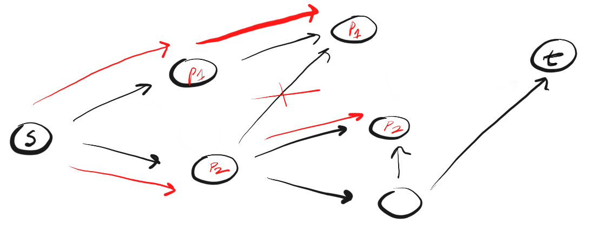
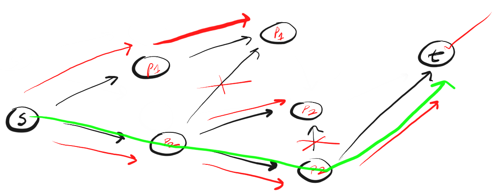
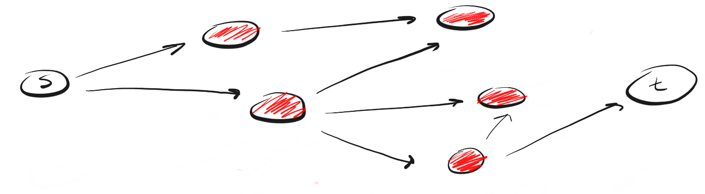
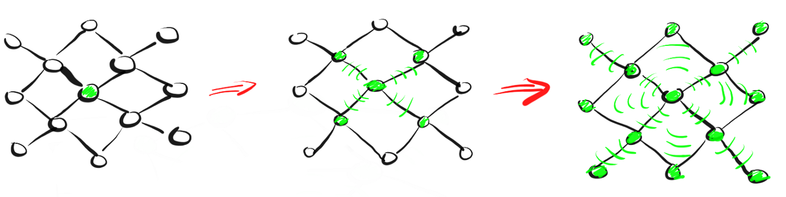

# 1. Определение связности графа, древовидности. Определение компонент связности графа. Обходы в глубину и в ширину.

::: details Понятие графа

<span class="defn">Опр.</span> Граф - это структура данных, состоящая из множества вершин ($V$) и множества рёбер ($E$), соединяющих пары вершин.

Граф - `G<V,E>`, где
+ $V$ - множество вершин
+ $E$ - множество ребер

По ребрам графы делятся на:
+ ориентированные
+ неориентированные

$w: E \rightarrow \mathbb{Z} \ -$ вес ребра.

Обходы:
+ В ширину (BFS - Breadth-First Search) - по уровням
+ В глубину (DFS - Depth-First Search) - по веткам
:::

## Связность графа

::: info  <span class="defn">Опр.</span> Связность неориентированного графа
Граф является связным, если существует хотя бы одна цепь между любыми двумя его вершинами. 
:::

> Определение выше дано для неориентированных графов. Для ориентированных графов вместо него используются понятия слабой и сильной связности.

::: info  <span class="defn">Опр.</span> Слабо связный ориентированный граф
Ориентированный граф называется слабо связным, если он является связным неориентированным графом после замены всех его рёбер на неориентированные. 
:::

::: info  <span class="defn">Опр.</span> Сильно связный ориентированный граф
Ориентированный граф называется сильно связным, если в нём существует (ориентированный) путь из любой вершины в любую другую. 
:::

## Компонента связности

>  <span class="defn">Опр.</span> *Компонента связности* графа $G$ – это подграф $G'$, в котором: 
> 1. Существует хотя бы одна цепь между любыми двумя вершинами $u$, $v$ $\in G'$.
> 2. Не существует цепи между $u \in G'$ и $w \not\in G'$. 


> <span class="defn">Опр.</span> *Компонента сильной связности* орграфа $G$ – это подграф $G'$, в котором: 
> 1. Существует хотя бы один путь между любыми двумя вершинами $u$, $v$ $\in G'$. Иными словами, все вершины находятся в каком-то контуре.
> 2. Не существует пути между $u \in G'$ и $w \not\in G'$. 

Но на лекциях были такие определения:

::: info  <span class="defn">Опр.</span> Компонента связности
Множество вершин, где между любыми двумя есть путь, при этом не обязательно прямой.

То есть, можно обвести в кружочек, и по ребрам не пройдем.
:::

::: info  <span class="defn">Опр.</span> Компонента сильной связности
Максимальное подмножество вершин, где существует путь между любой парой вершин в обе стороны.
:::

## Древовидность графа

::: info <span class="defn" >Опр.</span> Дерево 
* **Связный граф без циклов (связный ациклический граф)** -> основное определение;
* Связный граф с n-1 ребрами, где n - количество вершин;
* Ациклический граф, у которого n-1 ребро, где n - количество вершин.
:::

Несколько деревьев - это лес.

::: info `tip` Замечание
Только $n-1$ ребро в графе с $n$ вершинами не гарантирует нам то, что граф будет деревом.
:::

::: details Если захотите повыпендриваться знаниями того, что мы не проходили в этом году
**Ориентированное дерево** - слабо связный бесконтурный ориентированный граф, в котором только одна вершина имеет нулевую степень захода (в неё не ведут дуги), а все остальные вершины имеют степень захода 1 (в них ведёт ровно по одной дуге).  

Вершина с нулевой степенью захода называется **корнем** дерева, вершины с нулевой степенью исхода (из которых не исходит ни одна дуга) называются **концевыми вершинами или листьями**.
:::

## Обход в глубину

::: info <span class="defn">Опр.</span> Поиск в глубину
(Depth-First Search, DFS) — это алгоритм обхода графа, который исследует каждую ветвь до конца, прежде чем возвращаться назад (backtracking). Может быть реализован рекурсивно или итеративно (с использованием стека).

А вообще-то это рекурсивный алгоритм обхода корневого дерева или графа, начинающий в корневой вершине (в случае графа может быть выбрана произвольная вершина) и рекурсивно обходящий весь граф, посещая каждую вершину ровно один раз.
:::


Мы находимся в точке «s» и нам нужно найти вершину «t». Применяя DFS, мы исследуем один из возможных путей, двигаемся по нему до конца и, если не обнаружили t, возвращаемся и исследуем другой путь.


Что ж, это не конец пути 1, двигаемся дальше:


В конце пути 1 нет точки t -> возвращаемся и начинаем новый путь:


 Поскольку вершину, венчающую первое направление, мы уже посещали, то двигаемся по второй:



Мы вновь достигли конца пути, но не нашли t, поэтому возвращаемся назад.  
Следуем по третьему пути и, наконец, достигаем искомой вершины «t». Ура :)



Обход в глубину с помощью рекурсии из лекции:

```cpp
const int maxn = 1e5;
bool was[maxn]; // тут хранятся отметки о посещенных вершинах
void dfs(int a){
	was[a] = 1; // пометка о том, что вершину посетили
	for (auto v: g[a]){
		if (!was[v]){
			dfs(v);
		}
	}
}
```

Тоже рекурсия, но уже на Python:

```python
def dfs(graph, start):
    visited = set()
    
    def dfs_recursive(v):
        visited.add(v)
        for u, _ in graph[v]:  # graph — список смежности
            if u not in visited:
                dfs_recursive(u)
    
    dfs_recursive(start)
    return visited
```

Стековая версия обхода в глубину на Python:

```python
def dfs_iterative(graph, start):
    visited = set()
    stack = [start]
    
    while stack:
        v = stack.pop()
        if v not in visited:
            visited.add(v)
            for u, _ in graph[v]:
                if u not in visited:
                    stack.append(u)
    return visited
```
Алгоритмическая сложность алгоритма: $O(|V| + |E|)$.

Простанственная сложность: $O(V)$.

----

Представьте, что вы - мышка, которая идет по лабиринту в поисках сыра. Вы вынуждены попадать в тупики, возвращаться назад и исследовать новый путь, пока не дойдете до заветного кусочка. Вот так и работает DFS :)


## Обход в ширину

::: info <span class="defn">Опр.</span> Поиск в ширину
*Поиском в ширину* (англ. _breadth-first search_, *BFS*) называется алгоритм обхода корневого дерева или графа, начинающий в корневой вершине (в случае графа может быть выбрана произвольная вершина) и обходящий весь граф в порядке увеличения расстояния от начальной вершины, посещая каждую вершину ровно один раз.

Вместо того, чтобы двигаться по определенному пути до конца, BFS предполагает движение вперед по одному соседу за раз.
:::

Посмотрим на картинках:





Версия с очередью из лекции:

```cpp
vector<int> g[maxn];

void bfs(int s) {
    queue<int> q;
    q.push(s);
    
    vector<int> d(n, -1);
    d[s] = 0;
    
    while (!q.empty()) {
        int v = q.front();
        q.pop();
        for (int u : g[v]) {
            if (d[u] == -1) {
                q.push(u);
                d[u] = d[v] + 1;
            }
        }
    }
} 
```

Алгоритмическая сложность алгоритма: $O(|V| + |E|)$.

Простанственная сложность: $O(V)$.

----

Когда думаете про BFS, представьте, как камушек в воду падает и по воде расходятся круги:



## Краткий ответ на вопрос

::: warning Ответ

+ Граф является **связным**, если существует хотя бы одна цепь между любыми двумя его вершинами.
+ Ориентированный граф называется **слабо связным**, если он является связным неориентированным графом после замены всех его рёбер на неориентированные.
+ Ориентированный граф называется **сильно связным**, если в нём существует (ориентированный) путь из любой вершины в любую другую.
---
+ **Компонента связности** - множество вершин, где между любыми двумя есть путь, при этом не обязательно прямой.
+ **Компонента сильной связности** - максимальное подмножество вершин, где существует путь между любой парой вершин в обе стороны.
---
+ **Дерево** - связный граф без циклов (связный ациклический граф). Несколько деревьев - это лес.
---
+ **Поиск в глубину** и **поиск в ширину** используются для обхода графа.
+ *DFS* двигается по граням туда и обратно, а *BFS* распространяется по соседям в поисках цели.
+ *DFS* использует стек или рекурсию, а *BFS* — очередь.
+ Время выполнения обоих составляет *O(V + E)*, а пространственная сложность — *O(V)*.
:::