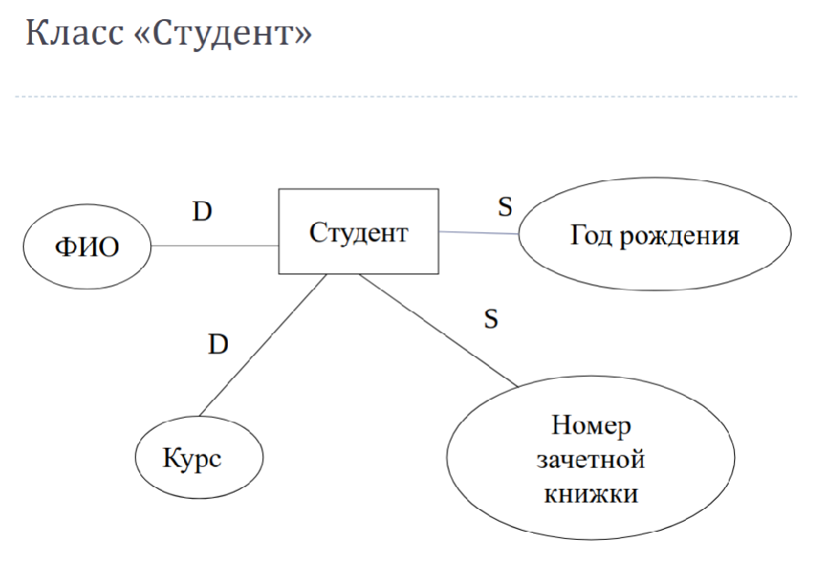
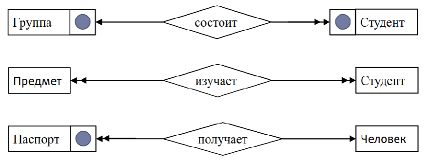

# 2. Теория нормализации. Продолжение

Преподаватель

| ФИО  | Имя   | Предмет | Должность |
| ---- | ----- | ------- | --------- |
| Яров | Ольга | Алгебра | Профессор |
| Яров | Иван  | Алгебра | Профессор |
| Яров | Ольга | Алгебра | Профессор |
| Яров | Ольга | Алгебра | Профессор |
| Яров | Ольга | Алгебра | Профессор |
| Яров | Ольга | Алгебра | Профессор |     |

Отношение не находится во 2 форме т.к. должность зависит от ФИО

## Четвертая нормальная форма
Отношение находится в 4 нормальной форме, если оно находится в форме Бойса-Кодда и в нем отстутствуют многозначные зависимости

Проведем декомпозицию предыдущего отношения.

+ Преподаватель 1(ФИО, Должность)
+ Преподаватель 2(ФИО, Имя)
+ Преподаватель 3(ФИО, Предмет)

## Свойство декомпозиции

$\rho : \rightarrow R1, R2, ... , Rk$

F F1,F2, ... Fk

Каждой новой схеме $R_i$ также соответствует множество функциональных зависимостей $F_i$
1. *Соединение без потерь*:
$$\all r(R) : r = \pi R_1(r) \pi R_2(R) \pi R_3(r) ... \pi R_k(r)$$

Возьмем проекцию данных, далее обратно их соединим \rightarrow получим то же самое

2. *Сохранение функциональных зависимостей*: 
$${F_1,F_2,F_3, ... , F_k} => F$$
зависимости - огр-я предметной области, если после декомпозиции потеряли ограничение \rightarrow субд его отслеживать не сможет и нужны доп. действия, чтобы зависимость реализовать

## Соедиенение без потерь
Пример:

Студент

| ФИО    | Город  | Группа |
| ------ | ------ | ------ |
| Иванов | Кемь   | 22305  |
| Петров | Кемь   | 22308  |
| Булкин | Сегежа | 22305  |

Проводим декомпозицию:

Студент 1

| ФИО    | Группа |
| ------ | ------ |
| Иванов | 22305  |
| Петров | 22308  |
| Булкин | 22305  |

Студент 2

| ФИО    | Город  |
| ------ | ------ |
| Иванов | Кемь   |
| Петров | Кемь   |
| Булкин | Сегежа |

Делаем проекцию, смотрим.

При этом разбиении свойство выполняется, соединили и получили исходное отношение

Проведем декомпозицию иначе:

Студент 3

| ФИО    | Группа |
| ------ | ------ |
| Иванов | 22305  |
| Петров | 22308  |
| Булкин | 22305  |
Студент 4

| Группа | Город  |
| ------ | ------ |
| 22305  | Кемь   |
| 22308  | Кемь   |
| 22305  | Сегежа |

Соединяем по группе, получаем неверную таблицу

Студент 3 Студент 4

Ловушка соединения:

| ФИО    | Город  | Группа |
| ------ | ------ | ------ |
| Иванов | Кемь   | 22305  |
| Иванов | Сегежа | 22305  |
| Петров | Кемь   | 22308  |
| Булкин | Сегежа | 22305  |
| Булкин | Кемь   | 22305  |

## Сохранение функциональных зависимостей
-----

| Студент | Предмет | Преподаватель |
| ------- | ------- | ------------- |
| Иванов  | Алгебра | проф. Белый   |
| Иванов  | Физика  | проф. Яров    |
| Петров  | Алгебра | проф. Белый   |
| Петров  | Физика  | проф. Серов   |

$$F = \begin{cases} {\{Студент, Предмет\}} \rightarrow Преподаватель \\ Преподаватель \rightarrow Предмет \end{cases}$$

Лекции 1

| Студент | Преподаватель |
| ------- | ------------- |
| Иванов  | проф. Белый   |
| Иванов  | проф. Яров    |
| Петров  | проф. Белый   |
| Петров  | проф. Серов   |

$F_1 = \{{\emptyset}\}$

Тут можем записать, что студент изучает физику у Ярова и физику у Серова, СУБД позволит, но наше ограничение "предмет у одного препода", ограничение мы потеряли(формируем триггер/ограничение/при вводе данных в прикладной программе)

Лекции 2

| Предмет | Преподаватель |
| ------- | ------------- |
| Алгебра | проф. Белый   |
| Физика  | проф. Яров    |
| Алгебра | проф. Белый   |
| Физика  | проф. Серов   |

$F_2$ = {Преподаватель \rightarrow Предмет}

## Теоремы
-----
### Теорема 1

Любое отношение, с множеством функц. зависимостей, можно привести к 3 нормальной форме, с помощью декомпозиции, обладающей свойствами соединение без потерь и сохранение функциональных зависимостей

### Теорема 2

Любое отношение, с множеством функциональных и многозначных зависимостей, можно привести к 4-й нормальной форме с помощью декомпозиции, обладающей свойством соединение без потерь.

Почему остановились на 4-й нормальной форме? Ибо на практике используем до нее, оно нам надо. 

> 3 нормальная форма - **общее требование**

# Проектирование реляционной БД
----
3 этапа проектиривания:
* Построение инфологической модели предметной области
* Построение реляционной модели данных
* Проектирование доп. объектов реляционной БД

Нельзя оканчивать на слове "модели", т.к. модель - отражение чего-то, надо уточнять чего. Будет 2 модели, они будут описывать разные объекты. Инфологическая модель - предметную область описывает. Реляционная модель данных - модель БД.

## Инфологическая модель предметной области

>**Инфологическая модель предметной области** - это описание предметной области, выполненное без ориентации на используемые в дальнейшем программные и тех. средства
>**Цель**: представление семантики предметной области
>Для описания используется модель <<сущность-связь>> (Entity-Relationship)(ERD, П. Чен , 1976 г.) (Это диаграммы)

В предметной области выбираем объекты, имеющий один набор атрибутов, такие однотипные объекты в классы оформляем и на диаграмме отображаем

> **Объект** - это предмет или идея, который может быть четко идентифицирован
> **Класс** - объекты, объединенные по признакам, характеристикам
> Свойства класса - набор атрибутов, которыми
 характеризуются все объекты в классе 

Свойства бывают статическими(не меняют свое значение) и динамическими
S - статическое
D - динамическое
При переводе студента на другое направление \rightarrow студент уже будет другой с точки зрения предметной области

В других предметных областях одни и те же свойства могут быть статическими, а в другой - динамическими(например, свидетельство о рождении - там ФИО не меняется)

Элементы данных имеют свой жизненный цикл. Если закончит студент универ \rightarrow то эти данные будут заархивированными и меняться не будут.

В предменой области описываем все классы. В БД будут хранятся элементы данных(студент - не элемент данных, а значения будут представлены в свойствах)

## Связи между классами

Классы, учавствующие в связи соединяются прямой линией. Все названия должны быть различными(две связи, 2 класса, 1 связь и класс с одинаковыми именами - такого быть не должно, свойства <u>могут быть</u> с одинаковыми именами)

Можно и связь между объектами одного и того же класса

У связи, как и у класса, могут быть свойства. Тут чаще всего и происходит ошибка(свойство мы приписываем к связи/классу). Надо четко понимать: что свойство класса, а что - связи. На помощь придет функц. зависимость, если она есть между двумя атрибутами - будет свойство класса. А если зависимость между тремя атрибутами, причем 2 из них относятся к одному классу, а одно - к другому - это будет свойством связи.

Хотим знать, какой конкретный товар и поставщик в какой конкретный магазин поставил. Тогда кол-во и дата будет свойством связи.
Если сделаем кол-во - свойством Поставщикам(значит поставщик всем магазинам в одном кол-ве поставляет), если не так - это не свойство поставщика. Может быть свойством товара? Если упаковка из 10 штук, ее нельзя разорвать - тогда свойство товара, но это не так. Свойство магазина - тогда товар поставляют для каждого магазина в определенном количестве, это тоже не так. Знаачит, это свойство связи.

## Типы бинарных связей
Чаще всего проектируются бинарные связи(м/д двумя классами). Т.к. можем добавить еще сопутствующую инфу, полезную для проектирования. Поэтому чаще всего формируются бинарные связи(как на картинке "между лю")
* По многознаачности
* По обязательности

### По многозначности
* один-к-одному
> 	одному объекту первого класса соответствует ровно один объект из второго класса и наоборот одному объекту из второго класса соответствует ровно один объект из первого класса 

Один факультет = один декан, один декан = один факультет, поэтому связь один к одному. Обозначать будем одинарными стрелками(с одним наконечником)

* один-ко-многим
> 	одному объекту из первого класса соответствует несколько объектов из второго класса и одному объекту из второго класса соответствует ровно один объект из первого класса

Пример: группа состоит из студентов

* многие-ко-многим
>  одному объекту из первого класса соответствует
   несколько объектов из второго класса и, наоборот,
   одному объекту из второго класса соответствует
   несколько объектов из первого класса 

Итого: по многозначности 3 типа связей

Чаще всего встречаются связи один-ко-многим и они напрямую реализуются в структуре реляционной БД, многие-ко-многим могут иметь свойства, <u>остальные типы связей свойств иметь не могут</u>

### По обязательности

> Связь является обязательной по отношению к классу, если существование объектов класса зависит от наличия связи

Группа без студентов быть не может! Этот значок стоит между классом и связи, ибо это свойство оно бинарное(относится и к классу, и к связи, поэтому стоит между классом и связью)

Студент может ничего не изучать(если аттестацию не проходит), предмет может быть, который не изучает ни один студент.
Т.о. связь изучает является не обязательно ни к студенту, ни к предмету.

Т.о. бинарные связи имеют доп. информацию(стрелки и элементы, обозначающие обязательность). <u>Эти элементы нельзя использовать, если связь между >2 кол-вом классом. Это относится и к связи, где один класс участвует</u>

Доп. обозначения:

часть-целое и наследование

Вся та же самая информация может быть представлена другим способом(в другой нотации, например, в нотации Баркера)