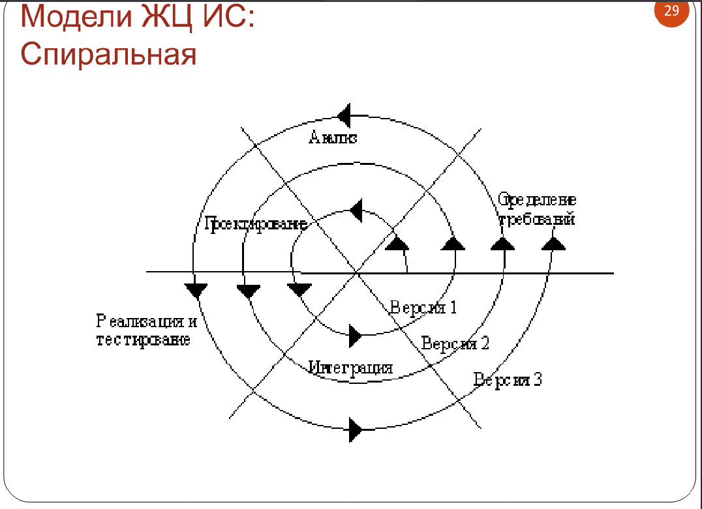
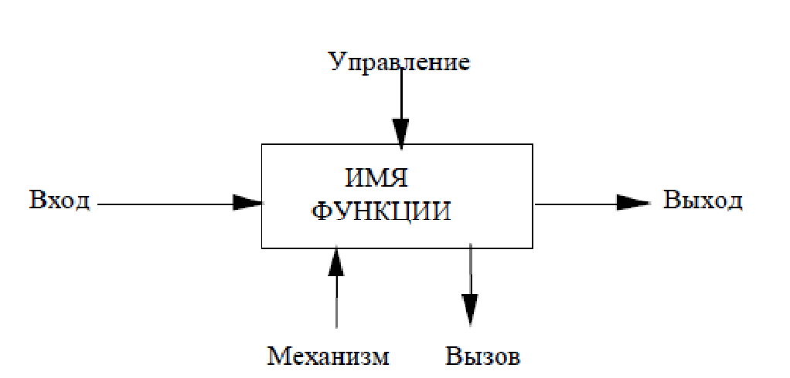
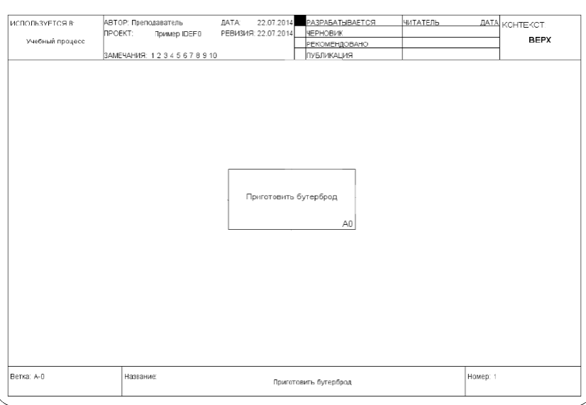
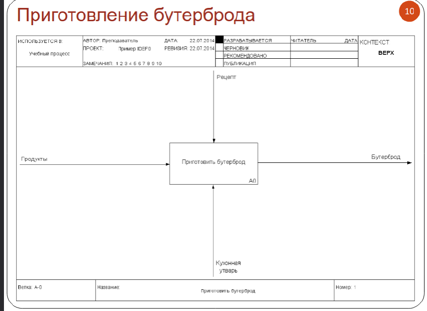

# 1. Введение

Проектирование информационных систем наш курс называется. В чем отличие программной и информационной систем?

Программная система - то, что запрограммированно (любая программа - программная система), а инф. система - это программная система, но она имеет доп. ограничения.

**Информационная система предназначена для поддержки деятельности БП.** 
Она поддерживает работу сотрудников в каком-то БП. Снабжает информацией БП

БП - любая человеческая деятельность. 

## Цели создания ИС
* Повышение эффективности БП - основа
* Уменьшение затрат БП
* Уменьшение рисков БП
* Повышение интероперабельности( возможности и прозрачности взаимодействия) БП
* Повышение безопасности БП
* Повышение управляемости БП

## Функции ИС
* **Предоставление информации** (осн. функция, отличающая ИС от других программных систем)
* Редактирование информации
* Хранение информации
* Обработка информации
* Получение и передача информации
* Управление объектами и системами

## Примеры ИС
ИАИС, в рамках университета - система бухгалтерского учета (чтобы деньги на карту пришли, нужно заявку в банк отправить, нужно рассчитать ЗП, далее отчислить налоги и т.д.) Обработка этой информации в рамках инф. системы происходит.

Пришли в кафе - официант работает с ИС, сформировал заказ, автоматически посчиталась стоимость.

## Классификация ИС
**По характеру использования информации**
* Поисковые
* Вычислительные
* Управляющие
* Учет, автоматизация и поддержка принятия решений
 
**По уровням управления:**
+ У основания макс. объем данным, это оперативный уровень.
+ В дальнейшем инфы меньше, это функциональный уровень, здесь генерируются управляющие команды, решаются более сложные задачи. 
+ Третий уровень - стратегические, здесь информации достаточно сжатая, итоговая - это уровень управления всей системой.

ИС, соответствующие уровням.

Самый нижний уровень (где производство) - АСУ ТП - автоматические системы управления 

Далее уровень планирования и подготовка производства - АСУПП (MES - Manufacturing Execution System)

Управление предприятием - АСУП(Автоматические системы управления предприятием) (ERP - Enterprise Resource Planning)

Стратегия и маркетинг - OLAP (Online Analytical Processing) - здесь менее всего автоматизирована функция, т.к. она требует информации не о самом предприятии, но и объем внешной информации (как предприятие выглядит на фоне всей отрасли, какие конкуренты и т.п.)

Поддерживаемые стандарты и технологии:
* MRP
* CRP
* MRPII
* SCM
* CRM

## Жизненный цикл ИС

Жизненный цикл начинается, когда появляется идея о автоматизации БП или какой-то функции, затем идут этапа ЖЦ, ЖЦ завершается, когда ИС снимается с эксплуатации. 

### Модели ЖЦ ИС

**Каскадная**

1. Анализ требований (обследование предметной области) в результате которого мы должны подготовить документ, которым будем руководствоваться при разработке, этот документ - ТЗ (техническое задание)
2. Проектирование  на основе сформулированных требований проектируем общую архитектуру системы, определяем роль пользователей, уровень доступа пользователей, проектируем пользователсьский интерфейс, проектируем интерфейс с другими ИС, программируем алгоритмы, структуру БД.
3. Реализация - кодирование и тестирование. Должны реализовать проект в виде программного кода и он должен работать.
4. Внедрение 
5. Сопровождение включает в себя и настройки, и добавление функций (это про весь путь кстати). Обеспечение работы системы.

В рамках ПИС мы будем затрагивать 2 этапа: анализ требований и проектирование.

Это была одна из моделей (каскадная, или водопадная)

Эта модель подразумевает, что на каждом этапе выполнены все работы, а к концу подготовлен пакет документов (то, что сделано):

+ Анализ - ТЗ, 
+ Проектирование - Проект, 
+ Реализация - листинги кода, 
+ Внедрение - еще документы и пакт о внедрении. 

В некоторых случаях в процессе проектирования и т.п. что-то не получилось, хотелось бы вернуться обратно и проектировать.

**Каскадная с возвратом**

В этой модели с каждого этапа можем вернуться на предыдущие. 

Недостатки: сроки. Сколько будем возвращаться? Сложно планировать, сколько по времени нужно затратить на каждый из этапов.

**Спиральная**

Каждый виток заканчивается готовым прототипом. Мы сделали уже работающую версию программной системы. И эту готовую версию пользователь использует. И в процессе эксплуатации могут появиться пожелания и т.п, которые мы используем в дальнейшем и доделываем. Получили фидбек - доделываем и т.д.

Стандарты ЖЦ ИС:
* ГОСТ Р ИСО/МЭК 12207-2010/. Процессы жизненного цикла программных средств
* ГОСТ Р ИСО/МЭК ТО 15271-2002 . Руководство по применению ГОСТ Р ИСО/МЭК 12207-2010
 
*(Буква "Р" после ГОСТ значит, что он международный, его перевели и адаптировали и приняли в РФ)*

В этом стандарте **основные процессы ЖЦ**:
* Заказ
* Поставка
* Разработка
* Эксплутация
* Сопровождение

**Вспомогательные процессы ЖЦ**:

* Документирование
* Управление конфигурацией
* Обеспечение качества
* Верификация
* Аттестация
* Совместный анализ
* Аудит
* Решение проблем

**Организационные процессы ЖЦ**:
* Управление 
* Создание инфраструктуры
* Усовершенствование
* Еще чет

**Модели ЖЦ ИС по ГОСТ Р 15271 - 2002**:
* Каскадная
* Инкрементная(это спиральные)
* Эволюционная(это спиральные)

## Анализ требований

Этот этап начинается с того, что мы исследуем предметную область. 

Важные моменты:
* БП
* Информационные потоки

### Описание БП в предметной области
 
Это некоторые функции, которые выполняют работники организации. Нужно их выявить и описать.

Сегодня с помощью функциональной диаграммы (модели) будем это делать.

Будем описывать не словами, а методологии. 

#### **IDEF0**

Icam DEFinition - была разработана такая программа интегрирования компьютеризации производства

SADT - метод структурного анализа и проектирования.

В рамках методологии IDEF мы описываем систему: БП, организационная система и все вообще.

Будем рассматривать **IDEF0** - описывает функциональную модель

Опирается на графическое представление(диаграммы), на диаграмме основной элемент - функция. 

Она изображается в виде прямоугольника, каждая сторона несет свою нагрузку.

Стороны прямоугольника:
* **Вход** - то, из чего или кого выполняется функция
* **Выход** - результат функции
* **Управление** - регламентирует управление функцией
* **Механизм** - то, с помощью чего выполняется функция
* **Вызов** - если нужно вызвать дополнительные функции

У каждой функции должен быть **выход**. Остальные стрелки могут отсутствовать. Если нет выхода - функция, не имеющая результата

Таких диаграмм строится несколько, это набор диаграмм. 

Набор имеет иерархическую структуру:
+ Начинается с одной функции, которая представляет всю предметную область, а далее мы уточняем. 
+ Каждая диаграмма описывает действия и то, как они связаны между собой.

Пример IDEF0:
> Пример описания БП для предметной области "Приготовление бутерброда"
> 
> Пусть будет бутерброд, состоящей из булки, сверху - колбаса, сыр, все это запечем в духовке.
> Для описания диаграмм используется специальный шаблон, он включает в себя номер диаграммы, название диаграммы, доп. инфу(когда создавалось, кем создавалось, контекст (в каком месте находится диаграмма из всего дерева))
    

+ Вход - продукты
+ Выход - бутерброд 
+ Механизм - кухонная утварь
+ Управление - рецепт

Следующая диаграмма:

С диаграммы верхнего уровня придут стрелки (будут входить или заходить в рамку диаграммы). Наша задача соединить стрелки.