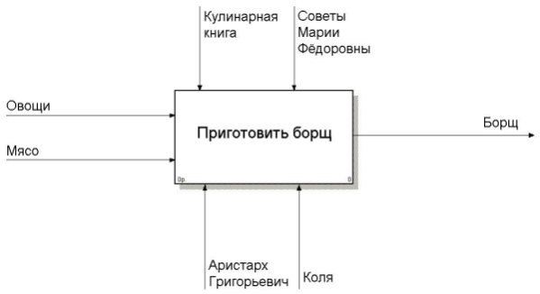

# 49. Умение строить диаграмму IDEF0

Функциональное моделирование начинается с определения основной задачи, которая решается путем выполнения этого бизнес-процесса. В нашем случае — «приготовить борщ».

Для начала стоит определить, какими данными и материалами мы обладаем до выполнения бизнес-процесса (_входные данные/input_), а также четко обозначить, что мы хотим получить в результате выполнения бизнес-процесса (_выходные данные/output_). В случае приготовления борща на входе имеются, например, овощи и мясо (их может, конечно, и не быть, но допустим, что все продукты были предусмотрительно закуплены). На выходе мы должны вполне логично получить борщ.

<highlight>Нотация IDEF0</highlight> предполагает, что для проведения функционального моделирования нужно выделить так называемый **механизм (mechanism)**, т. е. тех исполнителей, которые будут задействованы в бизнес-процессе. В нашем примере в качестве механизма выступает собственно Аристарх Григорьевич и, скажем, его старший сын Коля. Правильное выполнение процесса должно чем-то контролироваться (стандартами, методиками, технологиями). В нотации IDEF0 это называется **«управлением» (control)** и обязательно должно фигурировать на функциональной диаграмме.

Когда бизнес-аналитик выявил входные и выходные данные, установил механизм и способы управления, можно свести всю эту информацию в первую диаграмму, называемую **контекстной диаграммой**. Выглядеть она будет так, как на рисунке 1.

Рис. 1. Контекстная диаграмма

> Основная цель контекстной диаграммы — выявить <highlight>главную задачу</highlight>, которую решает выполнение бизнес-процесса. Особенно контекстная диаграмма важна при компоновке общего взгляда на решаемую бизнес-задачу: что нам требуется и в каком количестве, что мы получим на выходе, кто задействован в бизнес-процессе, какие регулирующие документы нам необходимы для качественного решения поставленной задачи.

Контекстная диаграмма не дает полного видения процесса, лишь общий взгляд. Для того, чтобы просмотреть последовательность выполнения процесса, нужно подкрутить колесико микроскопа: декомпозировать диаграмму, т. е. дать чуть более детальное описание процесса. Мелкие задачи эти могут быть как последовательными, так и параллельными. Скажем, в случае приготовления борща эти задачи сводятся к: приготовлению бульона, подготовке овощей, варке и подаче блюда на стол. Понятно, что готовить бульон и подготавливать овощи можно одновременно, а вот подать борщ до того, как он заправлен, уже получится плохо. Получим диаграмму, например, такую, как показано на рисунке 2.

Рис. 2. Диаграмма декомпозиции первого уровня

> Таким же образом можно декомпозировать каждую из указанных небольших функций до достижения необходимой степени детализации.

Особенно важно при этом то, что для каждого декомпозиционного блока указывают и входные данные, и выходные данные. Т.е. мы контролируем потоки ресурсов, распределяя их. Можно понять, что необходимо отложить часть работ.

Чтобы из диаграммы было видно, какие блоки подвергаются последующей декомпозиции, а какие — нет, левый верхний угол блоков, которые декомпозиции не подвергаются, перечёркивается чертой. Если такой черты нет — блок имеет декомпозицию.

> Маленькие задачи оценить проще, чем большие.
