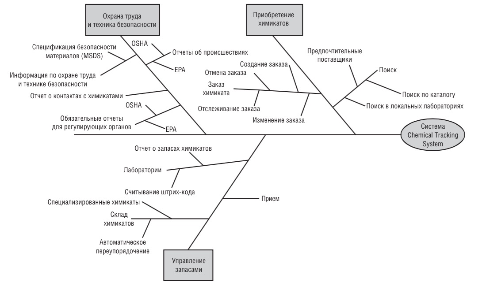

# 51. Умение строить дерево функций

==Дерево функций (feature tree)== — это иерархическая структура, которая показывает разбиение основной функции системы на составные подфункции. Она отвечает на вопрос «Что делает система?».

Дерево функций помогает:

- Структурировать функциональность системы.
- Спланировать разработку.
- Создать удобный интерфейс для пользователей.

## Структура

Функции могут быть описаны с различными уровнями детализации. На самом верхнем уровне описываются наиболее сложные функции, например, функции подразделений или последовательности бизнес-процессов. Затем они разбиваются на функции, которые делятся на подфункции, и т. д. до элементарных функций. Обычно элементарной считается функция, которую выполняет один исполнитель, то есть в ней нет разделения зоны ответственности.

Некоторые элементы диаграммы:

- Ствол — представляет реализуемый продукт.
- У каждой функции — собственная линия или «ветка», отходящая от ствола.
- Функции уровня 1 — например, «Приобретение химикатов» и «Управление запасами».
- Функции уровня 2 — «Поиск» и «Заказ химикатов» — подфункции функции «Приобретение химикатов».
- Функции уровня 3 — «Поиск в локальных лабораториях» — подфункция функции «Поиск».

## Методика построения

Исходными данными для формирования дерева функций являются основные и дополнительные функции системы. Формирование дерева — процесс декомпозиции целевой функции и множества основных и дополнительных функций на более элементарные функции, реализуемые на последующих уровнях декомпозиции.

Некоторые рекомендации по построению:

- Чётко формулировать функции — например, вместо «Работа с данными» указывать конкретные операции.
- Указывать непересекающиеся функции — например, поиск и фильтрация — разные функции.
- Присваивать уникальные ID для каждой функции.

## Применение

Диаграмма «Дерево функций» используется в различных областях, например:

- Проектирование программного обеспечения — помогает структурировать требования и спроектировать удобный интерфейс системы.
- Моделирование деятельности организации — позволяет графически описать функции отделов компании и построить их в иерархическом порядке.
- Анализ модели организации — диаграмма помогает найти повторяющиеся функции в подразделениях, например, для формирования перечня централизованных сервисов.
