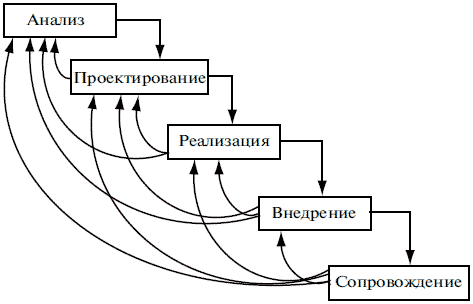

# 9. Каскадная с возвратом модель жизненного цикла ИС

::: warning :small_orange_diamond: Кратко
Каскадная модель с возвратом:

+ Межэтапные корректировки -> меньшая трудоемкость
+ Недостатки: запаздывание с результатами, “замороженные” требования

:::

## Каскадная с возвратом модель жизненного цикла ИС

Преимущество:

+ межэтапные корректировки обеспечивают меньшую трудоемкость по сравнению с каскадной моделью.

Недостатки:

+ существенное запаздывание с получением результатов.

> Согласование результатов с пользователями производится только в точках, планируемых после завершения каждого этапа работ, требования к ИС "заморожены" в виде технического задания на все время ее создания. Таким образом, пользователи могут внести свои замечания только после того, как работа над системой будет полностью завершена. В случае неточного изложения требований или их изменения в течение длительного периода создания ПО, пользователи получают систему, не удовлетворяющую их потребностям.

+ время жизни каждого из этапов растягивается на весь период разработки.
