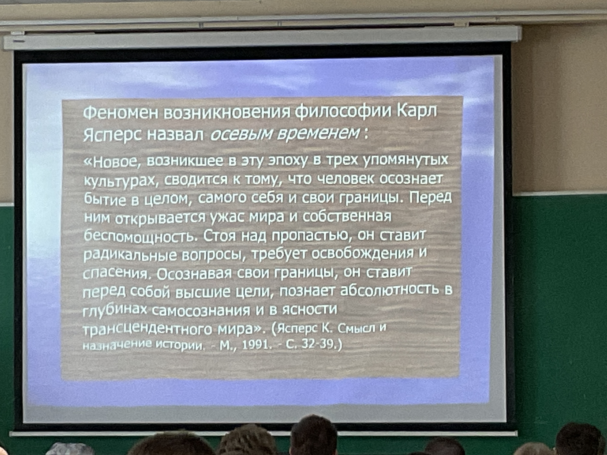
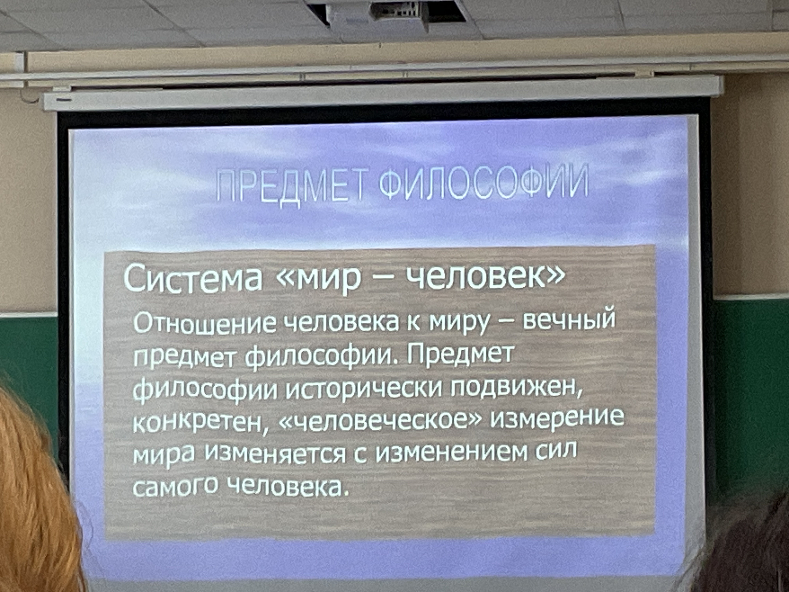
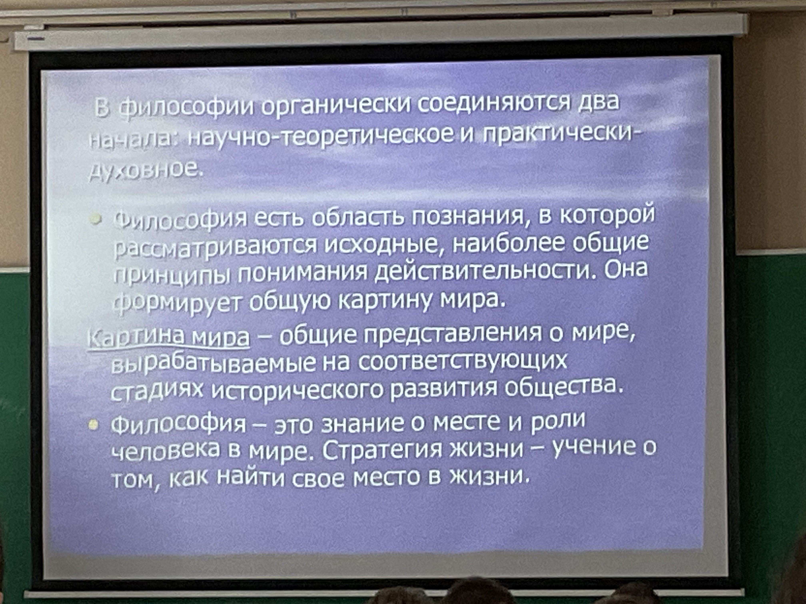
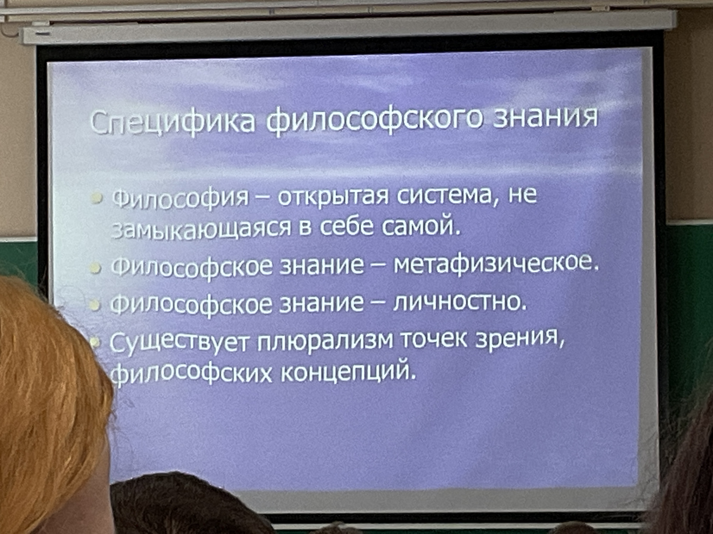

# 1. Введение в философию. Философия древнего мира

Философия - любовь к мудрости.

Отличается от религии опорой на разум. Автономно появилась в Древней Греции в VI веке до н.э., а также в Древнем Китае и Древней Индии.

Ознаменовала переход от древнего к цивилизованному обществу.

## Древняя Индия
Не отделение от религии, а тесная связь с ней.

Индуизм зародился в VIII до н.э. 

Упанишады — тексты о системе мира. Дословно переводится "сидеть у учителя" 

Мир имеет следующее строение:
+ Брахман (божественное начало, совершенная энергия)
+ Атман (индивидуализированное сознание, которое себя создает, включает в себя другие души)
+ Из Атмана появляются боги, люди, животные, материя, растения. 
+ Переход происходит при помощи кармы. 
+ При нарушении кармы душа переходит в сансару - цикл перерождения после смерти, в котором нужно отрабатывать карму.

Касты людей (с санскрита - цвет):
+ Брахманы (жрецы)
+ Кшатрии (воины)
+ Вайшья (земледельцы)
+ Шудры (неприкасаемые, самая плохая карма)

--- 

Миф подчиняется логике абсурда — при помощи магии возможно все. Ритуалы (почтение богам) регулируют жизнь людей. 

Философия начинается с космологии, порядка, и с этики — морали, нравственного поведения человека в обществе. 

## Буддизм

Отрицание бессмертия души и ее существования, антропология, этика, космология, человеческая жизнькак проблема.

Основателем буддизма считается Будда. Исповедующие буддизм считают его реальным человеком, историки — собирательной личностью. 

Санскрит — просветленный, познавший истину. 

У Будды есть реальное имя — Сиддхарта Гаутама. Родители воспитывали Будду во дворце, чтобы у него была безупречная карма, никто не причинил ему зла. Повзрослев, Будда покинул сад, встретив в деревне разных людей. Он узнал, что в мире есть смерть, и покинул дом, чтобы найти причину страданий.

В 33 года Будда понял, в чем причина страданий — в желании. По его учениям, чтобы перестать страдать, нужно достигнуть нирваны, перестать желать чего-либо. 

Нирвана — состояние между жизнью и смертью, когда человеку не нужны ни еда и вода, ни какие-либо вещи, даже дыхание замедляется. 

По учению буддизма настоящая свобода — свобода от желания, от внешнего мира.

В буддизме есть разные школы, которые ставят перед собой разные задачи. У каждой школы есть свой правильный образ жизни, правильная речь, мораль, физические упражнения, и так далее. У всех есть общие заповеди (например, отказ от алкоголя). Смысл в том, чтобы сократить страдания человека, научив его желать только правильных вещей, которых ему легко достичь. 

## Древний Китай

Основные философии Китая — конфуцианство и даосизм.

### Даосизм

Дао — путь, ведущий к благодати; начало всех вещей.

Происхождение даосизма связывают с именем Лао Цзы, который написал книгу «Дао дэ цзин». 

Лао Цзы устал от жизни в обществе, но покинуть страну просто так было нельзя. Когда Лао Цзы попросил разрешения покинуть страну, власти приказали ему написать книгу о своей философии, после чего он мог бы уйти в горы или куда ему еще захочется. 

Лао Цзы написал короткую поэму о дао. По его мнению в процессе создания мира общее начало разделилось на четыре части. Инь и ян, четыре элемента, в середине цзи — человек. Человек — тоже часть космоса. 

Недеяние — выбор из всех занятий того, что получается лучше всего, и развитие этого умения до совершенства. Неконфликтность, спокойствие. 

### Конфуцианство

Родился в аристократической семье. Отец Конфуция умер, его воспитывала мать, жили бедно, занимался тяжелым физическим трудом.

Основатель — Кун Фу Цзы — рассказывал про жэнь, человеколюбие. Каждый человек по его мнению достоин любви.
Заслужил внимание состоятельных людей, на их пожертвования построил первый в Китае университет.

Культ образования ради чина.

Некоторое время конфуцианство было национальной религией.

Социальная философия - учение про общество, где общество - патриархальная семья, которая только в единстве сильна и богата.

Во время ритуалов уравниваются простой народ и власть имущие.

---

## Осевое время 
— время возникновения самосознания. 

Плчему в VI веке до н.э.?
1. Перехрод от локальной к мировой истории
2. Рефлексия и изменение культуры и этики => самосознание
3. Новое понимание смерти, как проблемы. В чем смысл жизни, если смерть - это неизвестность?

Трасцендентный мир - другой мир после смерти.

Самосознание в культуре — философия. Философия позволяет обнаружить идеи, которые лежат в основе религии, хозяйства, жизни людей. 

Карл Ясперс - философ, медик и техник.

---

Бессознательное (в социальном значении) — влияние внешних факторов (мировоззрения других людей, рекламы, …) на человека

Философия существует как наука, теоретическая дисциплина — предмет, преподаваемый в университете или другом учебном заведении. 

Философия как теоретическое начало необходима для формирования общей картины мира, наиболее общих принципов понимания действительности.

Философия как практически-духовное начало — знание о месте и роли человека в мире, его поиском себя, самопознанием, о стратегии жизни. 

Философское знание — метафизическое. В природе нет правды. 

Философское знание — личностно. Мифы творятся коллективно, а философия создается индивидуально.

Не существует правильных и неправильных мыслей в философии. 

## Что изучает философия?

1. **Античность:** Космос, мир природы с определенным порядком. Человек как мини-космос, который тоже может прийти к порядку.
2. Христианство: Бог связывает человека и мир. Все становится религиозным.
3. Новое время: Наука и техника связывают человека и мир.
4. Новейшее время: Наука не решает проблему смысла человеческой жизни, человек разумом не только решает задачи, но и становится зависимым. Индивидуальная и коллективная бессознательность. Как вернуть человеку сознание, не теряя бессознательность?