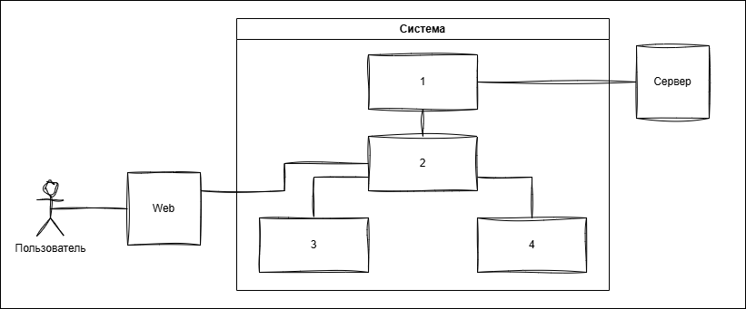
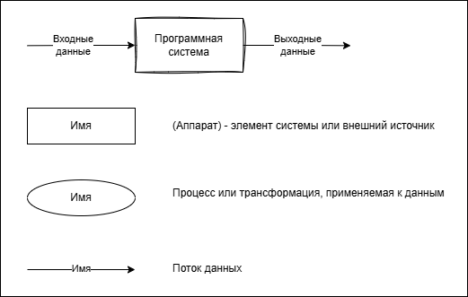
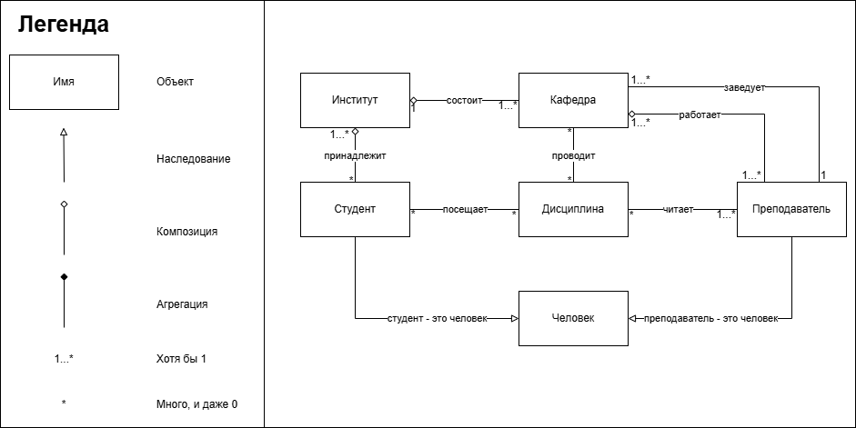
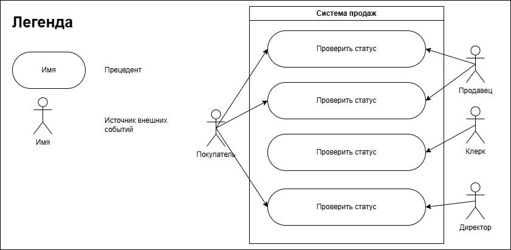
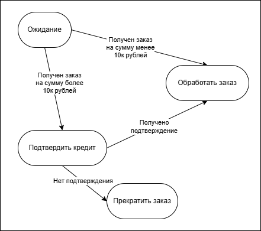

# 12. Моделирование: Основные виды моделей

## Про моделирование

**Модель** - упрощенное представление программной системы, отражающее только важные черты моделируемого объекта и игнорирующее остальные черты объекта.

### Классификация моделей:

1. Аналитические (математические) модели
	- Формулы
	- Схемы
2. Имитационные модели
	- Архитектура
	- Визуальная модель (прототип)

### Цели моделирования

1. Описание требований к системе и знаний предметной области (чтобы вовлеченные в проект стороны могли понять требования и прийти к общему соглашению)
2. Описание структуры программной системы (исследование возможных архитектурных решений до написания кода)
3. Отображение решений проекта в документации (правильно воспринять информацию по решениям проекта) -> 
	- Поведение системы (сценарии и алгоритмы работы)
	- Структуры данных
	- Состояния программной системы (значения переменных программы, текущий статус системы и данные в ней)
	- Потоки данных
4. Создание промежуточных результатов
	- Смета расходов
	- Проектирование форм UI (нужно для реализации в коде)
	- Сценарии использования программной системы (будущее руководство пользователя)
5. Комплексный взгляд на программную систему
	- С различными уровнями детализации (масштабирование)
	- Выбор эффективных решений (анализ альтернатив)
6. => Борьба со сложностью программного обеспечения (ПО становится сложнее, а модели упрощают описание)

### Принципы моделирования
1. Разбиение на уровни
	- Постепенная детализация
	- Наследование результатов
2. Визуальное моделирование
	- Диаграммы, схемы

3. Абстракция, а не полная детализация
	- Высокоуровневое описание
4. Спецификация, а не реализация
	- <u>ЧТО</u> требуется, а не <u>КАК</u> реализовать

## Виды моделей

### 1. ERD - диаграмма сущность-связь
Используется для моделирования предметной области, системного окружения, данных.

### 2. Глоссарий
Предназначен для описания предметной области и других областей, связанных с разработкой. Представляет собой список терминов предметной области или других областей проекта. *Своеобразный словарь для заказчиков и исполнителей.*

**Термин** - объект/предмет области (существительное, инфинитив)  
**Определение термина** - связь между объектами (глагол)

Если предметная область обширная, то список становится очень длинным. Так как его сложно читать, предпочтительнее сгруппировать термины по темам.

Структуризация глоссария:

- Высокоуровневые объекты
    - Задача
    - Пользователь
    - 1-4
    - Внешний сервер
И отдельные разделы для каждого высокоуровневого объекта.

Назначение - получить единое понимание предметной области, программной системы, системного окружения и рамок ПС: что нужно разрабатывать, а что есть готовое.
### 3. DFD - диаграмма потоков данных
Как данные преобразуются, проходя через программную систему.  
Используется для описания архитектуры, функциональных требований и поведенческих характеристик программной системы.

### 4. Объектные модели
**Класс** - множество возможных программных объектов.

**Наследование** - это связь между двумя классами, при которой один класс (наследник) получает все свойства и поведение другого класса (родителя) и может их дополнять или изменять.

**Композиция** — связь между двумя классами, при которой объект-часть не имеет независимого жизненного цикла и существует только внутри объекта-целого. Если целое уничтожается, все его части также уничтожаются.

**Агрегация** - связь между двумя классами, при которой объекты обоих классов могут иметь независимый жизненный цикл, но объект одного класса будет принадлежать определённому объекту другого класса в течение его жизненного цикла.

### 5. Модель прецедентов
Описывает сценарии использования (функциональную модель) программной системы с точки зрения пользователя (пользовательские [ФТ](10.md#функциональные-требования)) высокоуровневой моделью.

### 6. Модель конечных автоматов
Раздел математики, описывающий состояния программной системы и переходы между ними, которые вызываются различными событиями.

