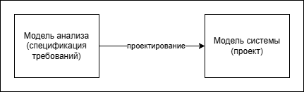
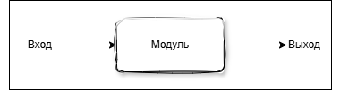
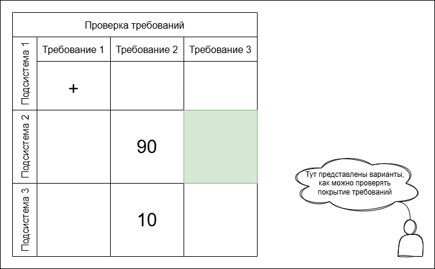
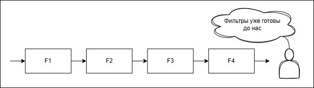
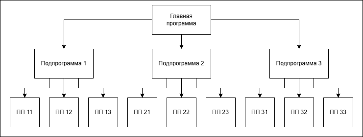
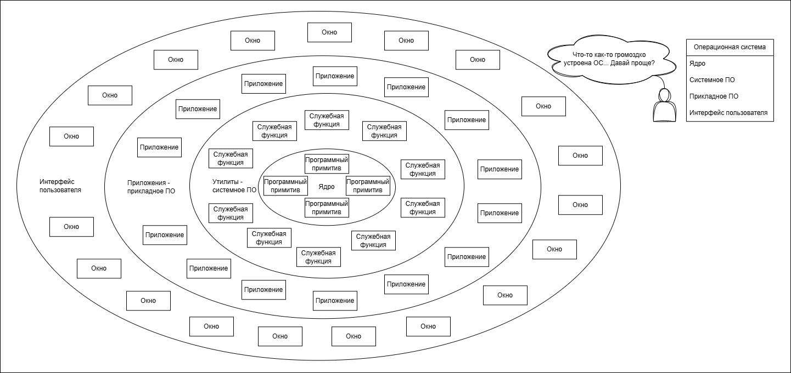
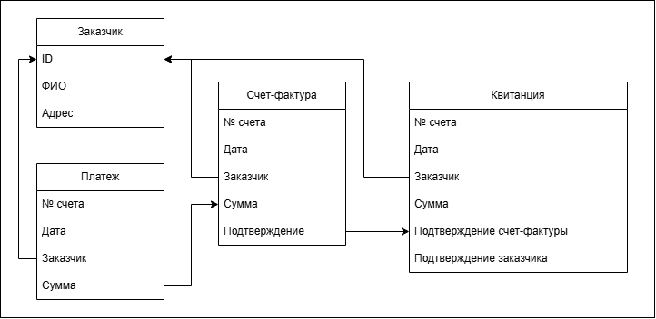

# 13. Проектирование: архитектура программной системы

> В ходе заполнения этой статьи использовались конспекты В. Панькова

## Проектирование
::: info Проектирование

Design (на английском языке) != project (включает и другие этапы помимо проектирования)

---

**Причины и роль проектирования**
1. Анализ (что решается?)
    - Планирование
2. Синтез (как?)
    - Проектирование
    - Кодирование
    - Тестирование
    - Аттестация
3. Сопровождение (что дальше?)

На стадии проектирования определяется, как и каким образом ПС будет реализовать требования, которые к ней предъявляются.

---
**Проектирование включает:**
1. Проектирование данных (структуры данных, форматы данных разрабатываются)
2. Проектирование архитектуры (из каких подсистем/модулей состоит ПС, как они взаимодействуют)
3. Проектирование интерфейсов подсистем

4. Проектирование интерфейса пользователя (UI) 

5. Проектирование подсистем (алгоритмы программных модулей и внутренние структуры данных для подсистем)

6. Проектирование тестов (способ проверки качества системы)

Основная причина выполнения проектирования - обеспечение качества.

---

**Характеристики качества проектирования**

1. Учтены все явные требования и есть учет неявных требований заказчика. (те требования, которые естественным образом появились при этапе разработки, в спецификации требований они не указаны, или неявные требования по типу: графический интерфейс пользователя должен быть)
	1. Как проверить? Составляется табличка:
		
2. Понятное и полное руководство для кодировщика и тестировщика
3. Всестронняя модель ПС 
	1. Нужно посмотреть на ПС с разных сторон и посмотреть на нее под разными углами:
		1. Данные
		2. Функциональность (какого рода функции ПС реализует)
		3. Поведение
		4. Эволюция (возможности для развития нужно закладывать на этапе проектирования)
		5. Информационная безопасность
		6. Производительность
		7. Точность результата
---

**Принципы проектирования**

1) Не использовать "взгляд через туннель"
	- Туннель - некая труба, через нее смотрим и видим маленький кусочек, того, чем нужно заниматься. Всесторонняя модель ПС говорит, что нам это мешает.  
	Мы должны предложить не частное решение, а должны быть альтернативы и обоснования выбора
2) Четкая взаимосвязь с требованиями
	- Трассируемость требований. Должны показать, где было требование такое-то и где оно отразилось (в какой подсистеме), отразить в тестах и в критериях аттестации.
	- Покрытие всех требований
3) Шаблоны проектирования
	- Не изобретать велосипед. Нужно воспользоваться уже имеющимися решениями - шаблонами архитектуры.
4) Структуризация
	- Декомпозиция (*разделение на части и решение более мелких задач*). Отдельно рассматриваем данные, функциональность, поведение, эволюция и пр.
	- Борьба со сложностью 
	- Учет возможных изменений.  
	Яркий пример - архитектура, систему разбиваем на подсистему, если нужно будет вносить правки в подсистему - изменяем лишь ее, другие - не трогаем
5) Однородность (*описание решений в одном стиле*) и интеграция (*сборка одного большого решения из множества маленьких*)
	- Разрабатываемые документы понятны всем разработчикам. Чтобы из маленьких подсистем собрать все в большую одну.
	- Командная работа, во многих проектах явно указывается, как документация оформляется
6) Учет нестандартных ситуаций
	- Подсистема обработки ошибок. 
	- Алгоритм проверки корректности данных.
	- Джентельменское поведение - ПС ведет себя как джентельмен, она будет достойно обрабатывать все случаи.
7) Проектирование != кодирование
	- Только названия файлов и функций
8) Минимальная "интеллектуальная дистанция" между ПС и поставленной задачей из практики
9) Оценка качества решений во время проектирования
	- Нужно понять, а насколько предложенное решение подходит под требования
:::

## Проектирование архитектуры

1. **Архитектура данных**  
Какого рода глобальные данные в ПС есть и как их представить

2. **Архитектура ПС**
	1. Разбиение на модули (подсистемы, компоненты)
	2. Взаимосвязь подсистем (ERD, дерево, сеть, линейная (если конвейер))
	3. Высокоуровневое описание интерфейсов
		- Потоки данных (структура, формат)
		- Обработчики данных (DFD)

---

**Принцип модульности**

**Архитектура** - декомпозиция программной системы на части для создания сложных (модульных) программных систем.

$T(x_1 + x_2) > T(x_1) + T(x_2),$ где T - время, x - модуль.

---

## Архитектурные стили (шаблоны)

### 1. Модель репозитория

Модель описывает централизованное хранилище данных.

### 2. Модель потоков данных (DFD)

Обработка потоков:
- Последовательная обработка -> классический конвейер
- Распараллеливание -> расщепление
- Объединение -> слияние
- Итеративная/циклическая -> обратная связь

**Последовательный фильтр**

### 3. Модель вызова-возврата
Когда много отклонений от иерархии, граф вызова-возврата становится громоздким, что затрудняет описание архитектуры.

	
Плюс - быстро, но

Минус - иерархическая структура не всегда возможна:
* потому что могут быть нарушения древовидной структуры - одна и та же подпрограмма вызывается другими различными подпрограммами
* возможно возникновение рекурсии (программа вызывает сама себя непосредственно или через посредников (цикл))

### 4. Модель клиент-сервер

Дальнейшая детвлизация архитектуры касается модели клиента (например, тонкий или толстый клиент). Также детализируется, как устроен сервер (серверная часть).

### 5. Модель абстрактной машины

Многоуровневая архитектура

### 6. Объектно-ориентированная модель

