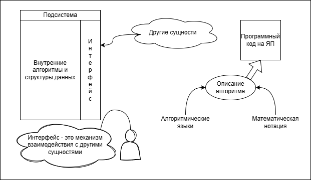
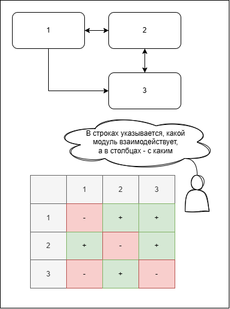

# 14. Проектирование: подсистемы и интерфейсы

## Детальное проектирование

С одной стороны требуется детализация описания, с другой стороны нельзя переходить непосредственно к программному коду, т.к. может потеряться логическая ясность описания (за кодом не увидим алгоритма). 

Алгоритм - модель вычислительного процесса.

## Интерфейс

Требуется четкое, формализованное описание правил взаимодействия.

Элементы:
- Набор функций и процедур для вызова других сущностей:
	- Процедура - имя, входные параметры, результат
	- Функция - частный случай процедуры, которая возвращает результат
	- API - интерфейс прикладного программирования
- Обмен сообщениями - имя, содержимое, реакция на сообщение (алгоритм обработки)
- Сигналы (события) - частный случай сообщения
	- имя, реакция подсистемы на сообщение, описание сигнала
- Потоки данных (конвейеры и фильтры)
	- формат, объем, интенсивность потока, схема получения (сеть, файл, общая память подсистем)

### Описание интерфейса
Для каждого элемена описываем:
- Что элемент делает, входные/выходные данные
- Описание стандартных и нестандартных ситуаций (например, корректность данных, запреты (как нельзя пользоваться, а еще как надо пользоваться в явном виде записываем))
- Таблицы взаимодействия подсистем:

Ассиметричное взаимодействие может быть!  
То есть в примере 1 -> 3 и все, 3 не взаимодействует с 1.

Вместо функций можем более детально характеризовать, что у нас за интерфейс. Может быть дополнительное описание, как соответствующее взаимодействие идет.

