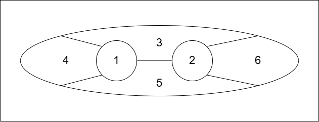
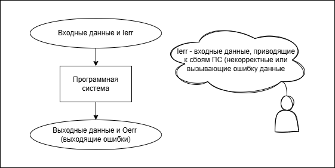

# 20. Разработка вариантов тестов. Метод черного ящика.

## Разработка вариантов тестов
::: details Основная информация
1. Мы знаем реализацию ПС ->  
[Белый ящик](19.md#метод-белого-ящика) - зная внутреннюю логику и структуру ПО, проверяем правильность реализации этой логики (алгоритмов и структур данных) решений проектирования.

2. Мы знаем структуру входных данных и ожиданмый результат ->  
[Черный ящик](20.md#метод-черного-ящика) - зная, что ПО должно делать, проверяем это на соответствующих тестах.

### Общие принципы тестирования:
1. **Тестирование  - организованный процесс.**  
План тестирования начинает разрабатываться задолго до выполнения тестирования.

2. Критерии аттестации определяют основу для выполнения аттестационного тестирования.

3. При проектировании разрабатывается основная чать модульных и интеграционных тестов на основе предполагаемых решений проектирования.

4. **Постепенное наращивание:**
    - Блочное тестирование *(маленькие тесты маленьких кусочков кода)*
    - Интеграционное тестирование *(работа связки модулей)*
    - Системное тестирование *(система в целом)* -> аттестационное тестирование

5. **Принцип "Парето"** в тестировании: 80% всех ошибок локализуются в 20% программных компонент.  
Таким образом, распределение тестов по программным компонентам неравномерно, лишь для 20% критических компонент разрабатывается 80% тестов. Не значит, что на остальные 80% кода тесты не нужны. Они нужны, но могут быть менее детальными (например, больше smoke-тестов и меньше глубоких интеграционных).

    Как найти критические компоненты?
    В основном это:
    - Ядро бизнес-логики (алгоритмы расчета, движки).
    - Модули интеграции с платежными системами, основными внешними API.
    - Системы аутентификации и авторизации.
    - Миграции и обработка критичных данных (финансовые транзакции, персональные данные).
    - Общие библиотеки и ядро платформы, используемые многими компонентами.

6. **Покрывающее тестирование.**  
Всеобъемлющее тестирование невозможно -> нужно выбрать варианты тестов из огромного числа возможных. Проведем разбиение множества тестов на классы, для каждого класса выберем несколько представителей и построим для них набор тестов.

7. **Независимое тестирование.**  
Основной объем тестирования проводит не автор кода, а другие разработчики и команда тестировщиков.
:::

## Метод черного ящика

Не понимаем, что внутри, но знаем, из чего и что должны получить. Это функциональное тестирование.

Не важно, как устроена ПС, мы проверяем:
- Функциональность критериев аттестации (правильность работы программных тестов)
- Поведение и производительность (время и корректность)
- Особенности работы для определенных типов данных
- Информационную безопасность (утечки данных)
- Устойчивость к сбоям и скорость восстановления после сбоя

### Варианты черного ящика

#### 1. Разбиение входных данных на классы эквивалентности (множество всех входных данных, в котором выделены отдельные большие части)

Цель:
- Разбить входные данные на покрывающее множество классов, для каждого разработать хотя бы один тест.

#### 2. Анализ граничных значений

Цель:
- Разработать тесты с с граничными или околограничными значениями.

Пусть $a_{min} \leq a \leq a_{max}$.

$a \approx a_{min}, \ a \approx a_{max}, \ a < a_{min}, \ a > a_{max} \ (\text{если } a_{max} \neq \infty)$.

#### 3. Системное тестирование
    - b2b testing - "спина к спине". 
    
Есть несколько реализаций одной и той же функции. Тест идет на все реализации, результаты сравниваются. Если не равны -> ошибка, иначе либо корректно, либо все неправильно считают.

