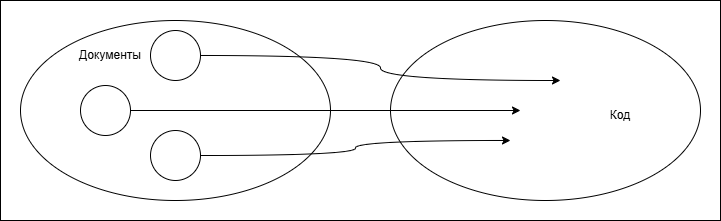
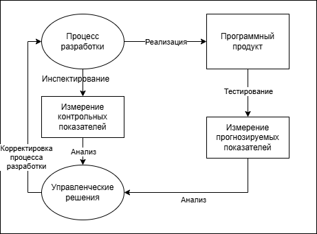

# 26. Управление проектом: Документация

Разработка ПО "живет" документацией.

Любая профессиональная разработка невозможна без бумажек. Это способ передачи информации между заинтересованными лицами.  
Есть тестая связь между документацией и программным кодом (информация из документов влияет на части кода, т.е. информация управляет кодированием)

Так, например
- код <- документ проектирования
- отладка <- документ тестирования

Документация должна быть рабочим инструментом разработчика.

Протокол собрания <- результат коллективной работы.

## Стандарты (правила) документации

1. Любая крупная компания имеет свои стандарты оформления технической документации.
2. Стандарты ГОСТ:
    - как писать технический отчет
    - как писать техническое задание
    - как писать научно-технический отчет

3. Международные стандарты:
    - IEEE
    - ACM

----

Использование стандарта упрощает:
- сравнение проектов (оценка затрат на новый проект по уже завершенному)
- стандартизация и унификация опыта (переделка документации под особенности проекта)
- переключение между проетами

## Проблемы управления
- обновления и отслеживания зависимостей (учет влияния обновления на другие части этого документа и/или на другие документы)
- управление (контроль) версиями -> репозиторий
    - возможность вернуться к предыдущей версии в случае неполадок
    - альтернативные ветви - несколько направлений развития проекта
    - стабилизация версии документа - фиксация текущей версии документа по решению разработчиков

> Программный код - частный случай документа

## Показатели ПО

Показатели характеризуют собственно ПО, процесс разработки, документацию.

Документация помогает планировать и проверять проектные решения.

### Типы показателей
- Контрольные показатели (соотносятся с процессом разработки, контролируют индивидуальных разработчиков)
    - среднее значение временных затрат на отладку ошибки
    - производительность индивидуального разработчика в человекочасах
- Прогнозируемые показатели (соотносятся с полученными результатами и помогают оценить выполнение требований)
    - размер ПС
        - число модулей
        - число строк кода
    - производительность (скорость работы)
    - время на решение задачи

----

Некоторые показатели нельзя оценить напрямую:
- удобство сопровождения
- сложность кода
- понятность пользовательского интерфейса

Подобные показатели складываются из многих факторов. Желательно построить матмодель (формулу) для вычисления таких показателей.

Например, $p = f(x_1, x_2,..., x_n)$, где
p - комплексный показатель
f - функция
x - количественный показатель

Так что показатели можно поделить иначе:
- Внешние (те, что представляют интерес и нуждаются в оценивании)
    - удобство сопровождения
    - надежность
    - переносимость (между ОС или архитектурами)
    - удобство эксплуатации
- Внутренние (поддающиеся измерению)
    - количество параметров в программных функциях
    - цикломатическая сложность (количество и уровень вложенности циклов в коде)
    - размер ПО в строках кода
    - количество сообщений об ошибках
    - размер руководства пользователя

А теперь о том, из чего складываются внешние показатели:

- Удобство сопровождения
    - количество параметров в программных функциях (чем больше, тем хуже)
    - цикломатическая сложность (чем больше, тем хуже)
    - размер ПО в строках кода (чем больше, тем хуже)
    - размер руководства пользователя (чем больше, тем лучше)

- Надежность
    - цикломатическая сложность (чем боьше, тем хуже)
    - сообщения об ошибках (чем больше, тем лучше)
    - размер ПО в строках кода (чем больше, тем хуже)

- Переносимость
    - количество параметров в программных функциях (чем больше, тем хуже)
    - размер ПО в строках кода (чем больше, тем хуже)

- Удобство эксплуатации
    - сообщения об ошибках (чем больше, тем лучше)
    - размер руководства пользователя (чем больше, тем лучше)