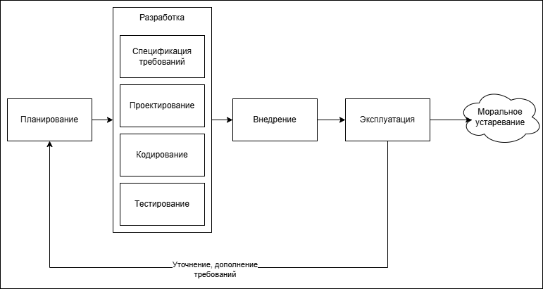
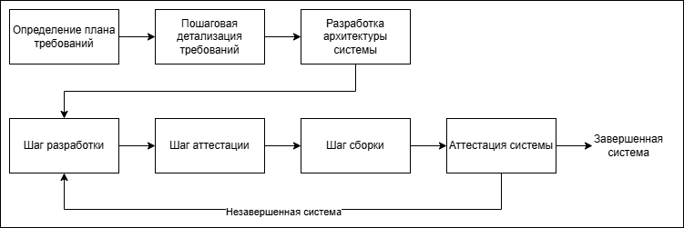

# 5. Модели процесса производства ПО. Эволюционная модель. Инкрементальная модель (пошаговая разработка)

## Модели процесса производства ПО

> 1) [Линейная (каскадная, водопадная) модель](../lectures/2)
>    + Классическая
>    + С возвратами
> 2) [Прототип (макет)](../lectures/3)
> 3) [Компонентная модель](../lectures/4)
> 4) [RAD Model - быстрая разработка приложения](../lectures/4)
> 5) **Эволюционная модель**
> 6) **Инкрементальная (пошаговая) модель**
> 7) [Спиральная модель](../lectures/6)

## Эволюционная модель
Эволюционный подход часто более эффективен, чем подход, построенный на основе
каскадной модели, особенно если требования заказчика могут меняться в процессе разра-
ботки системы. 

**Достоинством** процесса создания ПО, построенного на основе эволюционного подхода, является то, что здесь спецификация может разрабатываться постепенно, по мере того как заказчик (или пользователи) осознает и сформулирует те задачи, которые должно решать программное обеспечение. 

Вместе с тем данный подход имеет и некоторые **недостатки**:
1.	*Многие этапы процесса создания ПО не документированы.* Менеджерам проекта создания ПО необходимо регулярно документально отслеживать выполнение работ. Но если система разрабатывается быстро, то экономически не выгодно документировать каждую версию системы.
2.	*Система часто получается плохо структурированной.* Постоянные изменения в требованиях приводят к ошибкам и упущениям в структуре ПО. Со временем внесение изменений в систему становится все более сложным и затратным.
3.	*Часто требуются специальные средства и технологии разработки ПО.* Это вызвано необходимостью быстрой разработки версий программного продукта. Но, с другой стороны, это может привести к несовместимости некоторых применяемых средств и технологий, что, в свою очередь, требует наличия в команде разработчиков специалистов высокого уровня.

Эволюционный подход наиболее приемлем для разработки небольших программных систем (до 100 000 строк кода) и систем среднего размера (до 500 000 строк кода) с относительно коротким сроком жизни. На больших долгоживущих системах слишком заметно проявляются недостатки этого подхода.

## Инкрементальная (пошаговая) модель

Инкрементная модель является классическим примером инкрементной стратегии конструирования. Она объединяет элементы последовательной водопадной модели с итерационной философией
макетирования.

Каждая линейная последовательность здесь вырабатывает поставляемый инкремент ПО. Например,
ПО для обработки слов в 1-м инкременте реализует функции базовой обработки файлов, функции
редактирования и документирования; во 2-м инкременте — более сложные возможности
редактирования и документирования; в 3-м инкременте — проверку орфографии и грамматики; в 4-м
инкременте — возможности компоновки страницы.

Первый инкремент приводит к получению базового продукта, реализующего базовые требования
(правда, многие вспомогательные требования остаются нереализованными).

План следующего инкремента предусматривает модификацию базового продукта, обеспечивающую
дополнительные характеристики и функциональность.

По своей природе инкрементный процесс итеративен, но, в отличие от макетирования, инкрементная
модель обеспечивает на каждом инкременте работающий продукт. 

