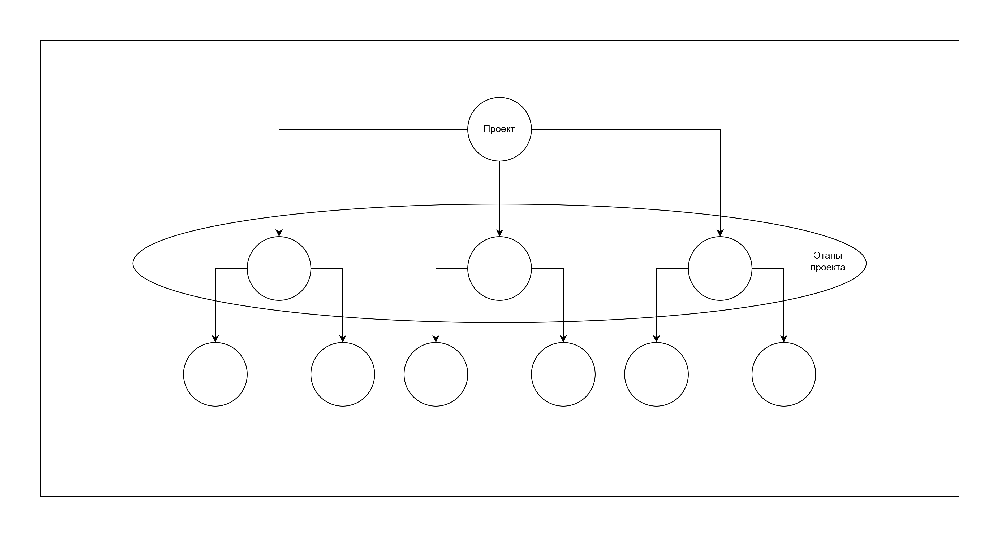
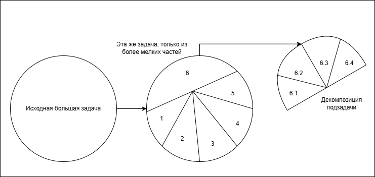
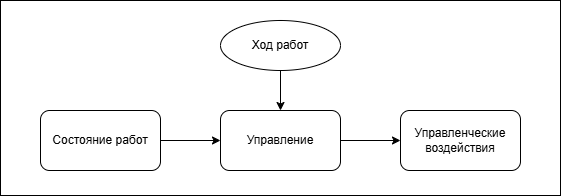
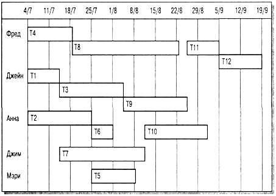
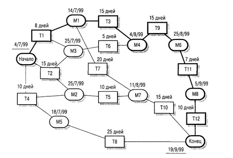

# 8. Планирование и график работ. Контроль хода выполнения работ

## Планирование

### Виды планов
- Общий план работ (этапы)
- Детализированный план работ (понедельный список задач)
- План качества (заявляются работы, которые не являются непосредственно разработкой, а чтобы обеспечить соответствующий уровень качества)
- План аттестации (некий спектакль, чтобы убедить заказчика, что разработанное ПО будет полезно ему, любое тестирование попадает и сюда (выясняется, что в первую очередь показывать заказчику))
> Здесть тестирование ПО и критерии аттестации - то, что будет показано на демострации заказчику
- План управления персоналом (
    - мероприятия по повышению квалификации, чтобы применить новые знания в проекте, 
    - увесилительные мероприятия (тимбилдинг), 
    - вознаграждение участников (сотруднику можно дать путевку)
    
    )

  ... есть и другие планы

План регулярно пересматривается в процессе управления проектом (если есть отклонения - устраняем (изменяем план, передать задачу другому разработчику, увеличить число разработчиков)). 

::: details К зачету
На зачете надо рассказать, как часто менялся план, почему и что вышло. (Не может быть так, что не меняли)
:::

**Планирование** - это итеративный (*изменяющийся*) процесс, т.е.в рамках некоторых итераций происходит смена плана, потому что появляется новая информация, возникают проблемы.

Стандартная итерация - неделя, но можно и чаще.

> Если в проекте нет проблем, значит, проект проблематичный...

### Декомпозиция задач
**Декомпозиция задач** означает формирование некой иерархии (древовидной структуры), в листьях которой появляются конкретные небольшие задачи. 

Нужно занести эти подзадачи в документ и работать с ними. Решение этих задач требует обхода в ширину, а не в глубину (по уровням двигаться, не сразу нырять к листу). 

> Например, дали задачу по разработке веб-приложения, мы увидили, что необходимо изучить разметку html.  
> Изучая html, где-то было написано, что он является частным случаем xml (а у нас в проекте его вообще нет).  
> Изучая xml, нашли инфу о том, что xml - это некое техническое представление формальной грамматики (это одна из первых теорий дискретной математики, которая имеет очень хорошее применение в программировании)  
> Итого мы в очень глубокой... математике =), которая далека от нашего исходного проекта, а другие задачи не рассмотрели и все, что очень плохо =(

Картиночки:

Про декомпозицию проекта:

Про декомпозицию одной задачи:

### Контрольные отметки этапов работ
Для управления проектом требуется получение информации для хода работ. Эта информация называется управленческой, она формируется в виде отчетов, рабочих часах.

Контрольные отметки этапов работ определяют состояние завершения этапа

Включается следующая информация:
- Степень готовности продукта
- Оценка произведенных затрат (по сути время в нашем случае, какую часть длительности этапа прошли, сколько часов потратили в сумме разработчики)
- Коррекция плана (если что-то не доделали в рамках этапа, этап нужно продлевать и продолжать, ну или быстро сделали и план уменьшается)

Метод черного ящика в производственных проектах **не применяется**!

(когда нет анализа и пр.)

Весь период выполнения проекта делится на этапы:

1 неделя (частый пересмотр графика работ) <= |этап| <= 8-10 недель (для крупных проектов)

Каждый этап (стадия) завершается отчетностью, на ее основе принимается решение о завершении/продлении этапа (задачи со стадии переносятся на следующую просто)

Пример: этап анализа требований

## График работ

**График работ** - часть плана с перечислением работ, их основных характеристик и связей друг с другом, а также времязатрат на этапы.

- Оценка длительности:
    - Сам проект в целом (просуммировав длит. этапов, мы получаем длит. проекта)
    - Каждый этап проекта (просуммировав, сколько времени для каждой стадии в этапе, получаем длит. этапа)
> Сложно становится, когда некоторые работы выполняются паралелльно.
- Ресурсы для выполнения этапов:
    - Число сотрудников
    - Рабочие места
    - Оборудование
    - Вычислительные ресурсы
    - Заработная плата сотрудникам
    - Время
- Согласованная последовательность этапов и работ (некая диаграмма в виде графа, для человека так удобней, это не просто перечисление этапов и работ.)

### Виды диаграмм:
- Временная диаграмма, или диаграмма Ганта (показывает время начала и окончания каждого этапа, а также его длительность)

    - Диаграмма распределения исполнителей по этапам
    
- Сетевая диаграмма (отображает зависимости между этапами работ)

**Критический путь** - минимальное время выполнения всего проекта, значение которого равно сумме в сетевой диаграмме длительности этапов на самом длинном пути от начала проекта до его окончания.

**Общая продолжительность реализации** проекта зависит от этапов работ, находящихся на критическом пути. Любая задержка в завершении любого этапа на критическом пути приведет к задержке всего проекта.

Задержка в завершении этапов, **не входящих в критический путь**, не влияет на продолжительность всего проекта до тех пор, пока суммарная длительность этих этапов (с учетом задержек) на каком-нибудь пути не превысит продолжительности работ на критическом пути.

Внимание к этапам критического пути часто позволяет найти способы их изменения с тем, чтобы сократить длительность всего проекта.

### Ключевая информация в графике работ
- Задачи (набор работ) и этапы.
- Какие ресурсы есть (разработчики, время, ...)
- Зависимость задач (что параллелельно, что последовательно)
- Распределение ответственности (кто какими задачами будет заниматься)
- Контрольные элементы (завершение задачи = отчет, он принимается или не принимается)